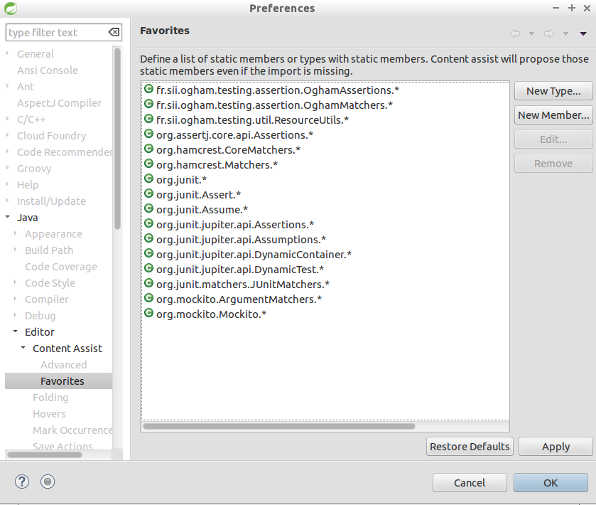

////
Do no edit this file, it is automatically generated. Sources are in src/docs/asciidoc.
////

http://groupe-sii.github.io/ogham/[Full documentation]


image:https://img.shields.io/maven-central/v/fr.sii.ogham/ogham-all.svg["Latest Release Standalone", link="https://mvnrepository.com/artifact/fr.sii.ogham/ogham-all/2.0.0"]
image:https://travis-ci.org/groupe-sii/ogham.svg?branch=master["Build Status", link="https://travis-ci.org/groupe-sii/ogham"]

image:https://sonarcloud.io/api/project_badges/measure?project=fr.sii.ogham%3Aogham-parent&metric=alert_status["Sonar", link="https://sonarcloud.io/dashboard?id=fr.sii.ogham%3Aogham-parent"]
image:https://sonarcloud.io/api/project_badges/measure?project=fr.sii.ogham%3Aogham-parent&metric=sqale_rating["Sonar", link="https://sonarcloud.io/dashboard?id=fr.sii.ogham%3Aogham-parent"]
image:https://sonarcloud.io/api/project_badges/measure?project=fr.sii.ogham%3Aogham-parent&metric=reliability_rating["Sonar", link="https://sonarcloud.io/dashboard?id=fr.sii.ogham%3Aogham-parent"]
image:https://sonarcloud.io/api/project_badges/measure?project=fr.sii.ogham%3Aogham-parent&metric=security_rating["Sonar", link="https://sonarcloud.io/dashboard?id=fr.sii.ogham%3Aogham-parent"]

image:https://sonarcloud.io/api/project_badges/measure?project=fr.sii.ogham%3Aogham-parent&metric=coverage["Sonar", link="https://sonarcloud.io/dashboard?id=fr.sii.ogham%3Aogham-parent"]
image:https://sonarcloud.io/api/project_badges/measure?project=fr.sii.ogham%3Aogham-parent&metric=sqale_index["Sonar", link="https://sonarcloud.io/dashboard?id=fr.sii.ogham%3Aogham-parent"]
image:https://sonarcloud.io/api/project_badges/measure?project=fr.sii.ogham%3Aogham-parent&metric=bugs["Sonar", link="https://sonarcloud.io/dashboard?id=fr.sii.ogham%3Aogham-parent"]
image:https://sonarcloud.io/api/project_badges/measure?project=fr.sii.ogham%3Aogham-parent&metric=vulnerabilities["Sonar", link="https://sonarcloud.io/dashboard?id=fr.sii.ogham%3Aogham-parent"]


= Ogham 
2.0.0


== Introduction


=== Existing libraries

Several libraries for sending email already exist: 

* https://commons.apache.org/proper/commons-email/[Apache Commons Email]
* https://github.com/bbottema/simple-java-mail[Simple Java Mail/Vesijama]
* http://docs.spring.io/spring/docs/current/spring-framework-reference/html/mail.html[Spring Email Integration]
* ... 

These libraries help you send an email but if you want to use a templated content, you will have to manually integrate a template engine.

These libraries also provide only implementations based on Java Mail API. But in some environments, you might NOT want to send the email directly but to use a web service to do it for you (https://sendgrid.com/[SendGrid] for example). Furthermore, those libraries are bound by design to frameworks or libraries that you might not want to use in your own context.

So, now you would want to find a sending library with a high level of abstraction to avoid binding issues with any template engine, design framework or sender service... Is email the only possible message type ? No, so why not sending SMS, Tweet or anything the same way ?


=== The Ogham module

This module is designed for handling any kind of message the same way. It also provides several implementations for the same message type. It selects the best implementation based on the classpath or properties for example. You can easily add your own implementation.

It also provides **templating support** and integrates natively several template engines. You can also add your own.

It is **framework and library agnostic** and provides bridges for **common frameworks integration** (Spring, JSF, ...).

When using the module to send email based on an HTML template, the templating system let you **design your HTML like a standard HTML page**. It automatically transforms the associated resources (images, css files...) to be usable in an email context (automatic inline css, embed images...). You don't need to write your HTML specifically for email.


== Quick start


[[install]]
=== Quick and simple inclusion


==== Standalone


[role=tab-container]
_____

[role=tab]
image:src/docs/resources/images/icons/maven-logo.png[Maven,width=118,height=30]

[source, xml, subs=attributes+]
----
<dependency>
    <groupId>fr.sii.ogham</groupId>
    <artifactId>ogham-all</artifactId>
    <version>2.0.0</version>
</dependency>
----

https://github.com/groupe-sii/ogham/blob/v2.0.0/sample-standard-usage/pom.xml?ts=4[View code of an example pom.xml]


[role=tab]
image:src/docs/resources/images/icons/gradlephant-logo.png[Gradle,width=114,height=30]

////
TODO: gradle code sample
////

[role=tab-container-end]
_____


This will include:

* Sending email through SMTP server (using https://javaee.github.io/javamail/[JavaMail])
* Sending email through https://sendgrid.com/[SendGrid]
* Sending SMS through SMPP server (using https://github.com/fizzed/cloudhopper-smpp[Cloudhopper])
* Sending SMS through https://www.ovhtelecom.fr/sms/api-sms.xml[OVH SMS API]
* http://freemarker.org/[FreeMarker] template engine available for building message contents
* http://www.thymeleaf.org/[ThymeLeaf] template engine available for building message contents


[[install-spring-boot]]
==== With Spring Boot


[role=tab-container]
_____

[role=tab]
image:src/docs/resources/images/icons/maven-logo.png[Maven,width=118,height=30]

[source, xml, subs=attributes+]
----
<dependency>
    <groupId>fr.sii.ogham</groupId>
    <artifactId>ogham-spring-boot-starter-all</artifactId>
    <version>2.0.0</version>
</dependency>
----

https://github.com/groupe-sii/ogham/blob/v2.0.0/sample-spring-usage/pom.xml?ts=4[View code of an example pom.xml with Spring Boot starter]


[role=tab]
image:src/docs/resources/images/icons/gradlephant-logo.png[Gradle,width=114,height=30]

////
TODO: gradle code sample
////

[role=tab-container-end]
_____


This will include:

* Sending email through SMTP server (using https://javaee.github.io/javamail/[JavaMail])
* Sending email through https://sendgrid.com/[SendGrid]
* Sending SMS through SMPP server (using https://github.com/fizzed/cloudhopper-smpp[Cloudhopper])
* Sending SMS through https://www.ovhtelecom.fr/sms/api-sms.xml[OVH SMS API]
* http://freemarker.org/[FreeMarker] template engine available for building message contents
* http://www.thymeleaf.org/[ThymeLeaf] template engine available for building message contents
* Support of https://projects.spring.io/spring-boot/[Spring Boot] auto-detection mechanism and configuration properties

You can combine Ogham with existing Spring Boot dependencies:

[role=tab-container]
_____

[role=tab]
image:src/docs/resources/images/icons/maven-logo.png[Maven,width=118,height=30]


[source, xml, subs=attributes+]
----
<dependency>
    <groupId>fr.sii.ogham</groupId>
    <artifactId>ogham-spring-boot-starter-all</artifactId>
    <version>2.0.0</version>
</dependency>
<dependency>
    <groupId>org.springframework.boot</groupId>
    <artifactId>spring-boot-starter-freemarker</artifactId>
</dependency>
<dependency>
    <groupId>org.springframework.boot</groupId>
    <artifactId>spring-boot-starter-thymeleaf</artifactId>
</dependency>
<dependency>
    <groupId>org.springframework.boot</groupId>
    <artifactId>spring-boot-starter-mail</artifactId>
</dependency>
----

[role=tab]
image:src/docs/resources/images/icons/gradlephant-logo.png[Gradle,width=114,height=30]

////
TODO: gradle code sample
////

[role=tab-container-end]
_____


Ogham will auto-configure to use Spring Boot additions and support Spring Boot configuration properties like `spring.mail.host` for example.

Ogham has been tested with following Spring Boot versions:

* 1.3.8
* 1.4.6
* 1.5.3

Using Java 8 and Java 7.


=== Select the features you need

==== Standalone


////
TODO: select dependencies with spring boot
////

==== With Spring Boot


////
TODO: select dependencies with spring boot
////


== Usage


NOTE: All samples with templates are using ThymeLeaf as template engine. For FreeMarker samples, take a look at <<freemarker, FreeMarker section>>.


[[email-usage]]
=== Send Email

The samples are available in the https://github.com/groupe-sii/ogham/blob/v2.0.0/sample-standard-usage[sample-standard-usage sub-project].

All samples shown bellow are using SMTP for sending email. See <<sendgrid, Sending email through SendGrid>> to know how to send email using SendGrid HTTP API.

==== First email using an existing SMTP server


This sample shows how to send a basic email.

The first lines configure the properties that will be used by the sender.
Then you must create the service. You can use the MessagingBuilder to help you to create the service.
Finally, the last line sends the email. The specified email is really basic. It only contains the subject, the textual content and the receiver address. The sender address is automatically added to the email by the service based on configuration properties.


[role=tab-container no-max-height]
_____

[role=tab]
image:src/docs/resources/images/icons/java-logo.png[width=16,height=30] Java

[source, java, role="collapse-lines:1-9 irrelevant-lines:1-9"]
----
package fr.sii.ogham.sample.standard.email;

import java.util.Properties;

import fr.sii.ogham.core.builder.MessagingBuilder;
import fr.sii.ogham.core.exception.MessagingException;
import fr.sii.ogham.core.service.MessagingService;
import fr.sii.ogham.email.message.Email;

public class BasicSample 

    public static void main(String[] args) throws MessagingException {
        // configure properties (could be stored in a properties file or defined
        // in System properties)
        Properties properties = new Properties();
        properties.put("mail.smtp.host", "<your server host>");
        properties.put("mail.smtp.port", "<your server port>");
        properties.put("ogham.email.from", "<email address to display for the sender user>");
        // Instantiate the messaging service using default behavior and
        // provided properties
        MessagingService service = MessagingBuilder.standard()        // <1>
                .environment()
                    .properties(properties)                            // <2>
                    .and()
                .build();                                            // <3>
        // send the email using fluent API
        service.send(new Email()                                    // <4>
                        .subject("subject")
                        .content("email content")
                        .to("ogham-test@yopmail.com"));
    

    public void test() 
        MessagingService service = MessagingBuilder.standard()
                .environment()
                    .properties()
                        .set("mail.smtp.host", "host01")
                        .set("mail.smtp.port", "587")
                        .and()
                    .and()
                .build();
                        
    
}
----
<1> Use the standard builder (predefined behavior)
<2> Register the custom properties
<3> Create a MessagingService instance
<4> Send an email with a subject and a simple body. The sender address is automatically set using `ogham.email.from` property

https://github.com/groupe-sii/ogham/blob/v2.0.0/sample-standard-usage/src/main/java/fr/sii/ogham/sample/standard/email/BasicSample.java?ts=4[Source code of the sample].

[role=tab-container-end]
_____


The construction of the email is done using a fluent API in order to chain calls and to have a more readable code.

Properties are directly provided in the code. You can instead <<properties-handling,use a configuration file>>.

[[email-template]]
==== Use an HTML template for email body


This sample shows how to send an email with a content following a template engine language.

[role="tab-container no-max-height"]
_____

[role=tab]
image:src/docs/resources/images/icons/java-logo.png[width=16,height=30] Java

[source, java, role="collapse-lines:1-10,35-47 irrelevant-lines:1-10,13-20 highlight-lines:29-30"]
----
package fr.sii.ogham.sample.standard.email;

import java.util.Properties;

import fr.sii.ogham.core.builder.MessagingBuilder;
import fr.sii.ogham.core.exception.MessagingException;
import fr.sii.ogham.core.message.content.TemplateContent;
import fr.sii.ogham.core.service.MessagingService;
import fr.sii.ogham.email.message.Email;

public class HtmlTemplateSample 
    public static void main(String[] args) throws MessagingException {
        // configure properties (could be stored in a properties file or defined
        // in System properties)
        Properties properties = new Properties();
        properties.setProperty("mail.smtp.host", "<your server host>");
        properties.setProperty("mail.smtp.port", "<your server port>");
        properties.setProperty("ogham.email.from", "<email address to display for the sender user>");
        // Instantiate the messaging service using default behavior and
        // provided properties
        MessagingService service = MessagingBuilder.standard()                                            // <1>
                .environment()
                    .properties(properties)                                                                // <2>
                    .and()
                .build();                                                                                // <3>
        // send the email using fluent API
        service.send(new Email()                                                                        // <4>
                        .subject("subject")
                        .content(new TemplateContent("classpath:/template/thymeleaf/simple.html",         // <5>
                                                    new SimpleBean("foo", 42)))                            // <6>
                        .to("ogham-test@yopmail.com"));
    

    public static class SimpleBean 
        private String name;
        private int value;
        public SimpleBean(String name, int value) {
            super();
            this.name = name;
            this.value = value;
        
        public String getName() 
            return name;
        
        public int getValue() 
            return value;
        
    }
}
----
<1> Use the standard builder (predefined behavior)
<2> Register the custom properties
<3> Create a MessagingService instance
<4> Send an email with a subject and a simple body that comes from the evaluated template. The sender address is automatically set using `ogham.email.from` property
<5> Indicate the path to the HTML template file (in the classpath)
<6> Use any bean object for replacing variables in template

https://github.com/groupe-sii/ogham/blob/v2.0.0/sample-standard-usage/src/main/java/fr/sii/ogham/sample/standard/email/HtmlTemplateSample.java?ts=4[Source code of the sample].

[role=tab]
image:src/docs/resources/images/icons/thymeleaf.jpg[width=30,height=30] ThymeLeaf template

[source, html]
----
<!DOCTYPE html>
<html xmlns:th="http://www.thymeleaf.org">                <!--1-->
    <head>
        <meta charset="utf-8" />
    </head>
    <body>
        <h1 class="title" th:text="$name"></h1>        <!--2-->
        <p class="text" th:text="$value"></p>            <!--3-->
    </body>
</html>
----
<1> Include the ThymeLeaf namespace
<2> Use the `name` attribute value in the template
<3> Use the `value` attribute value in the template

https://github.com/groupe-sii/ogham/blob/v2.0.0/sample-standard-usage/src/main/resources/template/thymeleaf/simple.html?ts=4[Source code of the HTML template]

[role=tab-container-end]
_____


Using a template is straightforward. Instead of providing a string content, you provide a `TemplateContent`.
The `TemplateContent` requires two information:

* The path to the template
* The variables to evaluate in the template

The path to the template is a string with a *lookup* prefix. The lookup prefix is used to indicate where to search the template (from file system, from classpath or anywhere else). Here we explicitly ask to load the template from classpath (using prefix `classpath:`). If no lookup is defined, classpath is used by default. See <<resource-resolution,Resource resolution section>> for more information.

The variables are any object you are using in your application. No need to convert your object to a particular format. Directly use what you want.

[[html-title-subject]]
==== Use HTML title as email subject


This sample is a variant of the previous one. It allows you to directly use the HTML title as subject of your email. It may be useful to use variables in the subject too, to mutualize the code and to avoid to create a new file just for one line.

[role="tab-container no-max-height"]
_____

[role=tab]
image:src/docs/resources/images/icons/java-logo.png[width=16,height=30] Java

[source, java, role="collapse-lines:1-11,36-48 irrelevant-lines:1-11,13-20"]
----
package fr.sii.ogham.sample.standard.email;

import java.util.Properties;

import fr.sii.ogham.core.builder.MessagingBuilder;
import fr.sii.ogham.core.exception.MessagingException;
import fr.sii.ogham.core.message.content.TemplateContent;
import fr.sii.ogham.core.service.MessagingService;
import fr.sii.ogham.email.message.Email;

public class HtmlTemplateWithSubjectSample 
    public static void main(String[] args) throws MessagingException {
        // configure properties (could be stored in a properties file or defined
        // in System properties)
        Properties properties = new Properties();
        properties.setProperty("mail.smtp.host", "<your server host>");
        properties.setProperty("mail.smtp.port", "<your server port>");
        properties.setProperty("ogham.email.from", "<email address to display for the sender user>");
        // Instantiate the messaging service using default behavior and
        // provided properties
        MessagingService service = MessagingBuilder.standard()
                .environment()
                    .properties(properties)
                    .and()
                .build();
        // send the email using fluent API (do not specify subject)
        // subject is set to null to let automatic mechanism to read the title
        // of the HTML and use it as subject of your email
        service.send(new Email()                                                                                // <1>
                        .content(new TemplateContent("classpath:/template/thymeleaf/simpleWithSubject.html", 
                                                    new SimpleBean("foo", 42)))
                        .to("ogham-test@yopmail.com"));
    
    
    public static class SimpleBean 
        private String name;
        private int value;
        public SimpleBean(String name, int value) {
            super();
            this.name = name;
            this.value = value;
        
        public String getName() 
            return name;
        
        public int getValue() 
            return value;
        
    }
}
----
<1> Subject is no more in Java code

https://github.com/groupe-sii/ogham/blob/v2.0.0/sample-standard-usage/src/main/java/fr/sii/ogham/sample/standard/email/HtmlTemplateWithSubjectSample.java?ts=4[Source code of the sample]

[role=tab]
image:src/docs/resources/images/icons/thymeleaf.jpg[width=30,height=30] ThymeLeaf template

[source, html, role="highlight-lines:4"]
----
<!DOCTYPE html>
<html xmlns:th="http://www.thymeleaf.org">
    <head>
        <title>Subject of the email - $name</title>                <!--1-->
        <meta charset="utf-8" />
    </head>
    <body>
        <h1 class="title" th:text="$name"></h1>
        <p class="text" th:text="$value"></p>
    </body>
</html>
----
<1> The subject is defined in the template and can use same evaluation context (`SimpleBean`)

https://github.com/groupe-sii/ogham/blob/v2.0.0/sample-standard-usage/src/main/resources/template/thymeleaf/simpleWithSubject.html?ts=4[Source code of the HTML template]

[role=tab-container-end]
_____


For text templates, the subject is automatically used (like for HTML title) if the first line starts with `Subject:` (spaces can be added after colon). Other lines are used as content of the email.


[role="tab-container no-max-height"]
_____

[role=tab]
image:src/docs/resources/images/icons/java-logo.png[width=16,height=30] Java

[source, java, role="collapse-lines:1-10,36-48 irrelevant-lines:1-10,13-20"]
----
package fr.sii.ogham.sample.standard.email;

import java.util.Properties;

import fr.sii.ogham.core.builder.MessagingBuilder;
import fr.sii.ogham.core.exception.MessagingException;
import fr.sii.ogham.core.message.content.TemplateContent;
import fr.sii.ogham.core.service.MessagingService;
import fr.sii.ogham.email.message.Email;

public class TextTemplateWithSubjectSample 
    public static void main(String[] args) throws MessagingException {
        // configure properties (could be stored in a properties file or defined
        // in System properties)
        Properties properties = new Properties();
        properties.setProperty("mail.smtp.host", "<your server host>");
        properties.setProperty("mail.smtp.port", "<your server port>");
        properties.setProperty("ogham.email.from", "<email address to display for the sender user>");
        // Instantiate the messaging service using default behavior and
        // provided properties
        MessagingService service = MessagingBuilder.standard()
                .environment()
                    .properties(properties)
                    .and()
                .build();
        // send the email using fluent API (do not specify subject)
        // subject is set to null to let automatic mechanism to read the title
        // of the first line if prefixed by "Subject:" and use it as subject of your email
        service.send(new Email()                                                                                // <1>
                        .content(new TemplateContent("classpath:/template/freemarker/simpleWithSubject.txt.ftl", 
                                                    new SimpleBean("foo", 42)))
                        .to("ogham-test@yopmail.com"));
    
    
    public static class SimpleBean 
        private String name;
        private int value;
        public SimpleBean(String name, int value) {
            super();
            this.name = name;
            this.value = value;
        
        public String getName() 
            return name;
        
        public int getValue() 
            return value;
        
    }
}
----
<1> Subject is no more in Java code

https://github.com/groupe-sii/ogham/blob/v2.0.0/sample-standard-usage/src/main/java/fr/sii/ogham/sample/standard/email/TextTemplateWithSubjectSample.java?ts=4[Source code of the sample]

[role=tab]

image:src/docs/resources/images/icons/freemarker-logo.png[width=60,height=24] Text template

[source, text, role="highlight-lines:1"]
----
Subject: Welcome $name !
Hello $name,

Foo bar $value
----

NOTE: The subject of the email will be `Welcome foo !`

https://github.com/groupe-sii/ogham/blob/v2.0.0/sample-standard-usage/src/main/resources/template/freemarker/simpleWithSubject.txt.ftl?ts=4[Source code of the text template]

[role=tab-container-end]
_____

[[css-images-inlining]]
==== HTML body with CSS and images


When you develop a Web application, you can use HTML for the content and CSS for layout and theming. HTML and CSS can use images to make a beautiful Web page. Each concern is separated in a different file. This is a good practice.

However, writing an HTML email is totally different. Indeed, email clients are not as evolved as Web browsers. Even worse, some clients disable some features on purpose (like Inbox that prevents using `style` tag). To make an email work on several clients, you should follow these rules:

* `` tags that use local images must be embedded
* Use XHTML instead of HTML
* Remove HTML comments (except conditional comments used to target Outlook)
* Add border=0 on all images to avoid an ugly border
* Do not write shortcut CSS values (`padding: 4px 4px 4px 4px;` instead of `padding: 4px`)
* Padding is not supported on some clients so you must use margins instead (adding a parent just for the layout)
* Background images on body should be moved on another node
* CSS3 properties are not supported
* ...

There are many other rules but the developer should not be constrained and should be able to write its HTML and CSS like as usual in Web browsers. Ogham simplifies image and CSS integration and is able to partially rewrite the HTML.  

[role="tab-container"]
_____

[role=tab]
image:src/docs/resources/images/icons/java-logo.png[width=16,height=30] Java

[source, java, role="collapse-lines:1-10,37-49 irrelevant-lines:1-10,13-20 highlight-lines:31,32"]
----
package fr.sii.ogham.sample.standard.email;

import java.util.Properties;

import fr.sii.ogham.core.builder.MessagingBuilder;
import fr.sii.ogham.core.exception.MessagingException;
import fr.sii.ogham.core.message.content.MultiTemplateContent;
import fr.sii.ogham.core.service.MessagingService;
import fr.sii.ogham.email.message.Email;

public class HtmlWithImagesAndCssTemplateSample 
    public static void main(String[] args) throws MessagingException {
        // configure properties (could be stored in a properties file or defined
        // in System properties)
        Properties properties = new Properties();
        properties.setProperty("mail.smtp.host", "<your server host>");
        properties.setProperty("mail.smtp.port", "<your server port>");
        properties.setProperty("ogham.email.from", "<email address to display for the sender user>");
        // Instantiate the messaging service using default behavior and
        // provided properties
        MessagingService service = MessagingBuilder.standard()
                .environment()
                    .properties(properties)
                    .and()
                .build();
        // send the email using fluent API
        // Note that the extension of the template is not given. This version
        // automatically takes the provided path and adds the '.html' extension
        // for the HTML template and '.txt.ftl' for text template
        service.send(new Email()
                        .content(new MultiTemplateContent("classpath:/template/withImagesAndCss/resources",        // <1>
                                                            new SimpleBean("foo", 42)))                            // <2>
                        .to("ogham-test@yopmail.com"));
    

    public static class SimpleBean 
        private String name;
        private int value;
        public SimpleBean(String name, int value) {
            super();
            this.name = name;
            this.value = value;
        
        public String getName() 
            return name;
        
        public int getValue() 
            return value;
        
    }
}
----
<1> The path to the templates
<2> The template context

https://github.com/groupe-sii/ogham/blob/v2.0.0/sample-standard-usage/src/main/java/fr/sii/ogham/sample/standard/email/HtmlWithImagesAndCssTemplateSample.java?ts=4[Source code of the sample]


[role=tab]
image:src/docs/resources/images/icons/thymeleaf-html.jpg[width=30,height=30] ThymeLeaf template

[source, html, role="highlight-lines:4"]
----
<!DOCTYPE html PUBLIC "-//W3C//DTD XHTML 1.0 Transitional//EN" "http://www.w3.org/TR/xhtml1/DTD/xhtml1-transitional.dtd">
<html xmlns="http://www.w3.org/1999/xhtml" xmlns:th="http://www.thymeleaf.org">
<head>
<meta http-equiv="Content-Type" content="text/html; charset=UTF-8" />
<title>Demystifying Email Design</title>
<meta name="viewport" content="width=device-width, initial-scale=1.0"/>
<link href="classpath:/template/withImagesAndCss/css/external1.css" rel="stylesheet" />
<link href="classpath:/template/withImagesAndCss/css/external2.css" rel="stylesheet" />
</head>
<body id="body_2a02_0">
    <table border="0" cellpadding="0" cellspacing="0" width="100%">    
        <tr>
            <td id="td_2a02_0">
                <table align="center" border="0" cellpadding="0" cellspacing="0" width="600" id="table_2a02_0">
                    <tr>
                        <td align="center" bgcolor="#70bbd9" id="td_2a02_1">
                            
                        </td>
                    </tr>
                    <tr>
                        <td bgcolor="#ffffff" id="td_2a02_2">
                            <table border="0" cellpadding="0" cellspacing="0" width="100%">
                                <tr>
                                    <td id="td_2a02_3">
                                        <b th:text="$name">$name</b>
                                    </td>
                                </tr>
                                <tr>
                                    <td id="td_2a02_4" class="paragraph" th:text="$value">
                                    </td>
                                </tr>
                                <tr>
                                    <td>
                                        <table border="0" cellpadding="0" cellspacing="0" width="100%">
                                            <tr>
                                                <td width="260" valign="top">
                                                    <table border="0" cellpadding="0" cellspacing="0" width="100%">
                                                        <tr>
                                                            <td>
                                                                
                                                            </td>
                                                        </tr>
                                                        <tr>
                                                            <td class="paragraph">
                                                                Lorem ipsum dolor sit amet, consectetur adipiscing elit. In tempus adipiscing felis, sit amet blandit ipsum volutpat sed. Morbi porttitor, eget accumsan dictum, nisi libero ultricies ipsum, in posuere mauris neque at erat.
                                                            </td>
                                                        </tr>
                                                    </table>
                                                </td>
                                                <td id="td_2a02_6" width="20">
                                                    &nbsp;
                                                </td>
                                                <td width="260" valign="top">
                                                    <table border="0" cellpadding="0" cellspacing="0" width="100%">
                                                        <tr>
                                                            <td>
                                                                
                                                            </td>
                                                        </tr>
                                                        <tr>
                                                            <td class="paragraph">
                                                                Lorem ipsum dolor sit amet, consectetur adipiscing elit. In tempus adipiscing felis, sit amet blandit ipsum volutpat sed. Morbi porttitor, eget accumsan dictum, nisi libero ultricies ipsum, in posuere mauris neque at erat.
                                                            </td>
                                                        </tr>
                                                    </table>
                                                </td>
                                            </tr>
                                        </table>
                                    </td>
                                </tr>
                            </table>
                        </td>
                    </tr>
                    <tr>
                        <td bgcolor="#ee4c50" id="td_2a02_8">
                            <table border="0" cellpadding="0" cellspacing="0" width="100%">
                                <tr>
                                    <td id="td_2a02_9" class="white" width="75%">
                                        &reg; Someone, somewhere 2013<br/>
                                        <a href="#" id="a_2a02_0" class="white"><font color="#ffffff">Unsubscribe</font></a> to this newsletter instantly
                                    </td>
                                    <td align="right" width="25%">
                                        <table border="0" cellpadding="0" cellspacing="0">
                                            <tr>
                                                <td class="link">
                                                    <a href="http://www.twitter.com/" class="white">
                                                        
                                                    </a>
                                                </td>
                                                <td id="td_2a02_11" width="20">&nbsp;</td>
                                                <td class="link">
                                                    <a href="http://www.twitter.com/" class="white">
                                                        
                                                    </a>
                                                </td>
                                            </tr>
                                        </table>
                                    </td>
                                </tr>
                            </table>
                        </td>
                    </tr>
                </table>
            </td>
        </tr>
    </table>
</body>
</html>
----

https://github.com/groupe-sii/ogham/blob/v2.0.0/sample-standard-usage/src/main/resources/template/withImagesAndCss/resources.html?ts=4[Source code of the HTML template]


[role=tab]
image:src/docs/resources/images/icons/css.png[width=37,height=30] CSS and images

[source, html, role="highlight-lines:4"]
----
TODO: add CSS file
----

Images


[role=tab]
 Sent HTML

[source, html, role="highlight-lines:4"]
----
TODO: sent HTML
----


[role=tab-container-end]
_____

////
TODO: image inlining
TODO: css inlining
TODO: rewrite html
TODO: you have control: attributes to enable/disable rules


TODO: explanation from old README
#### Working with HTML content

To be sure that most of Email clients will handle an HTML content, there are many rules to follow when writing the content. They might be very complex and time consuming. The library do all this headache work for you.

All these features can be either disabled or use another implementation instead of the default one.

##### Inline CSS and images

For Web developers, it is important to write clean code and separate the concerns. So when writing HTML, developers want to externalize CSS files and images. This is also really important to mutualize the code of CSS files and images for reuse.

However, email clients doesn't handle external CSS files. Styles can be included in a `style` tag but Gmail doesn't support it. So all rules provided in the CSS *MUST* be inlined directly in the HTML. Writing code like this is just awful and error prone. Moreover, images can be references externally but there are many constraints to use it this way. You have to know in advance what is the URL of the final image. And even then, the email client might block those images for safety purpose. Not mentioning offline issues.

The library will automatically inlines CSS rules directly on the HTML tags. The images are either inlined as base64 encoded in `img` `src` attribute or images are attached with the email (with inline content disposition and references in the HTML).

##### Use expanded CSS properties

CSS properties can be written using shorthand version:
```css
padding: 4px 2px;
```
This is equivalent to:
```css
padding: 4px 2px 4px 2px;
```

Some email clients do not understand shorthand properties. So all properties written in shorthand version must be expanded in order to work everywhere.

The library will automatically expand properties from shorthand versions.

##### Add extra attributes for old email clients

Several attributes must be added on some HTML tags in order to be compliant with email clients. For example, tables and images must have attribute `border="0"`in order to prevent an ugly border on some clients.

The library will automatically add these attributes.

##### Use XHTML

It is recommended to write XHTML instead of HTML due to some mail clients. The library do it for you.

##### Background images

Background images are not correctly handled by several mail clients. And again, some workarounds to apply to fix this issue.

The library will apply those workarounds to your HTML.

##### Use tables for layouts

////


* [x] `` tags that use local images are embedded (using `cid` reference)
* [x] `` tags that use local images are embedded (using base64 data URI)
* [ ] Use XHTML instead of HTML
* [x] Tables used for layout explicitly set default values
* [ ] Remove HTML comments (except conditional comments used to target Outlook)
* [ ] Add border=0 on all images to avoid an ugly border
* [ ] Do not write shortcut CSS values (`padding: 4px 4px 4px 4px;` instead of `padding: 4px`)
* [ ] Padding is not supported on some clients so you must use margins instead (adding a parent just for the layout)
* [ ] Background images on body should be moved on another node

////
TODO: other rules
////

[[text-alternative]]
==== A working preview of the HTML body (text alternative)


Sending an email with HTML content **and** text content might be really important, at least for smartphones. When a smartphone receives an email, it displays the sender, the subject and also a preview of the message, using the text alternative. If the message is only HTML, the preview might be unreadable.


[role="tab-container no-max-height"]
_____

[role=tab]
image:src/docs/resources/images/icons/java-logo.png[width=16,height=30] Java

[source, java, role="collapse-lines:1-10 irrelevant-lines:1-10,12-21,24-31 highlight-lines:40"]
----
package fr.sii.ogham.sample.standard.email;

import java.util.Properties;

import fr.sii.ogham.core.builder.MessagingBuilder;
import fr.sii.ogham.core.exception.MessagingException;
import fr.sii.ogham.core.message.content.MultiContent;
import fr.sii.ogham.core.service.MessagingService;
import fr.sii.ogham.email.message.Email;

public class HtmlAndTextSample 
    private static String html = "<!DOCTYPE html>"
                                + "<html>"
                                +     "<head><meta charset=\"utf-8\" /></head>"
                                +     "<body>"
                                +         "<h1 class=\"title\">Hello World</h1>"
                                +         "<p class=\"text\">Foo bar</p>"
                                +     "</body>"
                                + "</html>";
    private static String text = "Hello World !\r\n"
                                + "Foo bar";

    public static void main(String[] args) throws MessagingException {
        // configure properties (could be stored in a properties file or defined
        // in System properties)
        Properties properties = new Properties();
        properties.put("mail.smtp.host", "<your server host>");
        properties.put("mail.smtp.port", "<your server port>");
        properties.put("ogham.email.from", "<email address to display for the sender user>");
        // Instantiate the messaging service using default behavior and
        // provided properties
        MessagingService service = MessagingBuilder.standard()
                .environment()
                    .properties(properties)
                    .and()
                .build();
        // send the email using the fluent API
        service.send(new Email()
                        .subject("subject")
                        .content(new MultiContent(text, html))        // <1>
                        .to("ogham-test@yopmail.com"));
    
}
----
<1> The content is using the type `MultiContent` with a text and HTML content

https://github.com/groupe-sii/ogham/blob/v2.0.0/sample-standard-usage/src/main/java/fr/sii/ogham/sample/standard/email/HtmlAndTextSample.java?ts=4[Source code of the sample]

[role=tab-container-end]
_____

Just switching to a `MultiContent` let you provide a main content and an alternative content.


Obviously, you can use templates too. Even better, the following sample shows the shorthand version that avoids specifying twice the path to the templates (a single path without extension for both HTML and text template files).

[role="tab-container no-max-height"]
_____

[role=tab]
image:src/docs/resources/images/icons/java-logo.png[width=16,height=30] Java

[source, java, role="collapse-lines:1-10,38-50 irrelevant-lines:1-10,13-20 highlight-lines:32-33"]
----
package fr.sii.ogham.sample.standard.email;

import java.util.Properties;

import fr.sii.ogham.core.builder.MessagingBuilder;
import fr.sii.ogham.core.exception.MessagingException;
import fr.sii.ogham.core.message.content.MultiTemplateContent;
import fr.sii.ogham.core.service.MessagingService;
import fr.sii.ogham.email.message.Email;

public class HtmlAndTextTemplateSample 
    public static void main(String[] args) throws MessagingException {
        // configure properties (could be stored in a properties file or defined
        // in System properties)
        Properties properties = new Properties();
        properties.setProperty("mail.smtp.host", "<your server host>");
        properties.setProperty("mail.smtp.port", "<your server port>");
        properties.setProperty("ogham.email.from", "<email address to display for the sender user>");
        // Instantiate the messaging service using default behavior and
        // provided properties
        MessagingService service = MessagingBuilder.standard()
                .environment()
                    .properties(properties)
                    .and()
                .build();
        // send the email using fluent API
        // Note that the extension of the template is not given. This version
        // automatically takes the provided path and adds the '.html' extension
        // for the HTML template and '.txt' for text template
        service.send(new Email()
                        .subject("subject")
                        .content(new MultiTemplateContent("classpath:/template/thymeleaf/simple",         // <1>
                                                            new SimpleBean("foo", 42)))                    // <2>
                        .to("ogham-test@yopmail.com"));
    
    
    public static class SimpleBean 
        private String name;
        private int value;
        public SimpleBean(String name, int value) {
            super();
            this.name = name;
            this.value = value;
        
        public String getName() 
            return name;
        
        public int getValue() 
            return value;
        
    }
}
----
<1> The content is using the type `MultiTemplateContent` with only a path to the template files (without extension)
<2> The object used for evaluation as usual when using templates (same object used for both HTML and text)

https://github.com/groupe-sii/ogham/blob/v2.0.0/sample-standard-usage/src/main/java/fr/sii/ogham/sample/standard/email/HtmlAndTextTemplateSample.java?ts=4[Source code of the sample]

[role=tab]
image:src/docs/resources/images/icons/thymeleaf-text.jpg[width=30,height=30] Text template

.Text template located in `src/main/resources/template/thymeleaf/simple.txt`
[source, txt]
----
<html xmlns:th="http://www.thymeleaf.org" th:inline="text" th:remove="tag">
[[$name]] [[$value]]
</html>
----

https://github.com/groupe-sii/ogham/blob/v2.0.0/sample-standard-usage/src/main/resources/template/thymeleaf/simple.txt?ts=4[Source code of the text template]


[role=tab]
image:src/docs/resources/images/icons/thymeleaf-html.jpg[width=30,height=30] HTML template

.HTML template located at `src/main/resources/template/thymeleaf/simple.html`
[source, html]
----
<!DOCTYPE html>
<html xmlns:th="http://www.thymeleaf.org">                <!--1-->
    <head>
        <meta charset="utf-8" />
    </head>
    <body>
        <h1 class="title" th:text="$name"></h1>        <!--2-->
        <p class="text" th:text="$value"></p>            <!--3-->
    </body>
</html>
----

https://github.com/groupe-sii/ogham/blob/v2.0.0/sample-standard-usage/src/main/resources/template/thymeleaf/simple.html?ts=4[Source code of the HTML template]

[role=tab-container-end]
_____

Ogham will automatically determine file extensions to append according to the kind of message you are sending. For email, Ogham will search a HTML and a text file by default:

* Using ThymeLeaf, the file extensions are `.html` and `.txt` (configurable).
* Using FreeMarker, Ogham will search files with extensions `.html.ftl` and `.txt.ftl` (configurable).


If you are using a `MultiTemplateContent` and you only provide one template (only `HTML` for example). Ogham will not fail by default (configurable). Therefore, you can start your code with only a HTML template and add the text template later when you need it. That way, your Java code doesn't require any change.


It is possible to mix templates in the same application. Even better, you can use a template engine that is better suited for HTML like Thymeleaf and FreeMarker that is better for textual version for the same email. Just write your templates with the engine you want.


[role="tab-container no-max-height"]
_____

[role=tab]
image:src/docs/resources/images/icons/java-logo.png[width=16,height=30] Java

[source, java, role="collapse-lines:1-10,38-50 irrelevant-lines:1-10,13-20 highlight-lines:32-33"]
----
package fr.sii.ogham.sample.standard.email;

import java.util.Properties;

import fr.sii.ogham.core.builder.MessagingBuilder;
import fr.sii.ogham.core.exception.MessagingException;
import fr.sii.ogham.core.message.content.MultiTemplateContent;
import fr.sii.ogham.core.service.MessagingService;
import fr.sii.ogham.email.message.Email;

public class HtmlAndTextMixedTemplateEnginesSample 
    public static void main(String[] args) throws MessagingException {
        // configure properties (could be stored in a properties file or defined
        // in System properties)
        Properties properties = new Properties();
        properties.setProperty("mail.smtp.host", "<your server host>");
        properties.setProperty("mail.smtp.port", "<your server port>");
        properties.setProperty("ogham.email.from", "<email address to display for the sender user>");
        // Instantiate the messaging service using default behavior and
        // provided properties
        MessagingService service = MessagingBuilder.standard()
                .environment()
                    .properties(properties)
                    .and()
                .build();
        // send the email using fluent API
        // Note that the extension of the template is not given. This version
        // automatically takes the provided path and adds the '.html' extension
        // for the HTML template and '.txt.ftl' for text template
        service.send(new Email()
                        .subject("subject")
                        .content(new MultiTemplateContent("classpath:/template/mixed/simple",         // <1>
                                                            new SimpleBean("foo", 42)))                // <2>
                        .to("ogham-test@yopmail.com"));
    
    
    public static class SimpleBean 
        private String name;
        private int value;
        public SimpleBean(String name, int value) {
            super();
            this.name = name;
            this.value = value;
        
        public String getName() 
            return name;
        
        public int getValue() 
            return value;
        
    }
}
----
<1> The content is using the type `MultiTemplateContent` with only a path to the template files (without extension)
<2> The object used for evaluation as usual when using templates (same object used for both HTML and text)

https://github.com/groupe-sii/ogham/blob/v2.0.0/sample-standard-usage/src/main/java/fr/sii/ogham/sample/standard/email/HtmlAndTextMixedTemplateEnginesSample.java?ts=4[Source code of the sample]

[role=tab]
image:src/docs/resources/images/icons/freemarker-logo.png[width=60,height=24] Text template

.Text template located in `src/main/resources/template/mixed/simple.txt.ftl`
[source, txt]
----
$name $value
----

https://github.com/groupe-sii/ogham/blob/v2.0.0/sample-standard-usage/src/main/resources/template/mixed/simple.txt.ftl?ts=4[Source code of the text template]


[role=tab]
image:src/docs/resources/images/icons/thymeleaf.jpg[width=30,height=30] HTML template

.HTML template located at `src/main/resources/template/mixed/simple.html`
[source, html]
----
<!DOCTYPE html>
<html xmlns:th="http://www.thymeleaf.org">
    <head>
        <meta charset="utf-8" />
    </head>
    <body>
        <h1 class="title" th:text="$name"></h1>
        <p class="text" th:text="$value"></p>
    </body>
</html>
----

https://github.com/groupe-sii/ogham/blob/v2.0.0/sample-standard-usage/src/main/resources/template/mixed/simple.html?ts=4[Source code of the HTML template]

[role=tab-container-end]
_____

You can notice that the Java code has not changed at all (only the path for the sample). The aim is to use the template engine that best suits your needs.

==== Attach files to the email


[role="tab-container no-max-height"]
_____

[role=tab]
image:src/docs/resources/images/icons/java-logo.png[width=16,height=30] Java

[source, java, role="collapse-lines:1-12 irrelevant-lines:1-12,15-22 highlight-lines:33-34"]
----
package fr.sii.ogham.sample.standard.email;

import java.io.IOException;
import java.io.InputStream;
import java.util.Properties;

import fr.sii.ogham.core.builder.MessagingBuilder;
import fr.sii.ogham.core.exception.MessagingException;
import fr.sii.ogham.core.service.MessagingService;
import fr.sii.ogham.email.attachment.Attachment;
import fr.sii.ogham.email.message.Email;

public class WithAttachmentSample 
    public static void main(String[] args) throws MessagingException, IOException {
        // configure properties (could be stored in a properties file or defined
        // in System properties)
        Properties properties = new Properties();
        properties.put("mail.smtp.host", "<your server host>");
        properties.put("mail.smtp.port", "<your server port>");
        properties.put("ogham.email.from", "<email address to display for the sender user>");
        // Instantiate the messaging service using default behavior and
        // provided properties
        MessagingService service = MessagingBuilder.standard()
                .environment()
                    .properties(properties)
                    .and()
                .build();
        // send the email using fluent API
        service.send(new Email()
                        .subject("subject")
                        .content("content of the email")
                        .to("ogham-test@yopmail.com")
                        .attach(new Attachment("classpath:/attachment/test.pdf"))            // <1>
                        .attach(new Attachment("from-stream.pdf", loadInputStream())));        // <2>
    

    private static InputStream loadInputStream() 
        return WithAttachmentSample.class.getResourceAsStream("/attachment/test.pdf");
    
}
----
<1> Attach a PDF file that exists in the classpath to the email
<2> Use an `InputStream` and name the attachment

https://github.com/groupe-sii/ogham/blob/v2.0.0/sample-standard-usage/src/main/java/fr/sii/ogham/sample/standard/email/WithAttachmentSample.java?ts=4[Source code of the sample]

[role=tab-container-end]
_____

Attaching a file the the email is quite simple. You just need to provide the path to the file. The file is loaded from classpath but could also be loaded from file system or anywhere else (see <<resource-resolution, resource resolution section>>). In case you are using a file, the name of the attachment displayed in the email is automatically determined (`test.pdf` in the example).

It is often not possible to handle files directly. In that case you will use `InputStream` or `byte[]`. In that case, you need to name the attachment explicitly.

In both cases, the mimetype is automatically determined (`application/pdf` in this case). Mimetype is really important to ensure that the recipient(s) will be able to download or view the files correctly.

The file content is link to the email using `ContentDisposition.ATTACHMENT`.


NOTE: If you are using `InputStream`, you need to close the stream after sending the email.

TIP: You can also add a custom description for any attachment and link the file content to the email using `ContentDisposition.INLINE`

==== Globally configure default email fields


===== Globally configure default sender

You can configure sender address for all sent email by setting the property `ogham.email.from`. The value can either be an email address (`user@domain.host`) or an address with personal information (`User Name <user@domain.host>`). This property is used for every implementation (through SMTP, through SendGrid, ...).

This global address is used only if nothing is specified in the email. If you explicitly set the sender address in the email constructor or using the setter, this value is used instead of the global one.

[role=tab-container no-max-height]
_____

[role=tab]
image:src/docs/resources/images/icons/java-logo.png[width=16,height=30] Java

[source, java, role="collapse-lines:1-9 irrelevant-lines:1-9 highlight-lines:17,35"]
----
package fr.sii.ogham.sample.standard.email;

import java.util.Properties;

import fr.sii.ogham.core.builder.MessagingBuilder;
import fr.sii.ogham.core.exception.MessagingException;
import fr.sii.ogham.core.service.MessagingService;
import fr.sii.ogham.email.message.Email;

public class OverrideDefaultSenderSample 
    public static void main(String[] args) throws MessagingException {
        // configure properties (could be stored in a properties file or defined
        // in System properties)
        Properties properties = new Properties();
        properties.put("mail.smtp.host", "<your server host>");
        properties.put("mail.smtp.port", "<your server port>");
        properties.put("ogham.email.from", "foo.bar@test.com");                // <1>
        // Instantiate the messaging service using default behavior and
        // provided properties
        MessagingService service = MessagingBuilder.standard()
                .environment()
                    .properties(properties)
                    .and()
                .build();
        // send the email using fluent API
        service.send(new Email()                                            // <2>
                        .subject("subject")
                        .content("email content")
                        .to("ogham-test@yopmail.com"));
        // => the sender address is foo.bar@test.com

        service.send(new Email()
                .subject("subject")
                .content("email content")
                .from("override@test.com")                                    // <3>
                .to("ogham-test@yopmail.com"));
        // => the sender address is now override@test.com
    
}
----
<1> Set the default sender address globally using properties
<2> Do not provide `from` field so the sender address is `foo.bar@test.com`
<3> Override the default sender address by providing a `from` field. The address is now `override@test.com`

https://github.com/groupe-sii/ogham/blob/v2.0.0/sample-standard-usage/src/main/java/fr/sii/ogham/sample/standard/email/OverrideDefaultSenderSample.java?ts=4[Source code of the sample].

[role=tab-container-end]
_____

TIP: `mail.from` and `mail.smtp.from` also work


===== Globally configure default subject

As for sender address, you can define globally a default subject for emails if none is explicitly provided (neither using `.subject(String)` method nor defining a subject directly in the template). The property is `ogham.email.subject`.


===== Globally configure default recipients

You can also use properties to define default recipients if none are provided:

* `ogham.email.to`: set one or several recipient addresses (`to` field)
* `ogham.email.cc`: set one or several recipient addresses (`cc` field)
* `ogham.email.bcc`: set one or several recipient addresses (`bcc` field)

This can be convenient to set a `bcc` address for all sent messages for example (the `bcc` address will never be seen in received emails).

To define several recipient addresses, you can provide a string separated by `,`.


[role=tab-container no-max-height]
_____

[role=tab]
image:src/docs/resources/images/icons/java-logo.png[width=16,height=30] Java

[source, java, role="collapse-lines:1-24,26-34,51-70 irrelevant-lines:1-24 highlight-lines:41-43"]
----
package fr.sii.ogham.it.email;

import static fr.sii.ogham.assertion.OghamAssertions.assertThat;
import static org.hamcrest.Matchers.contains;
import static org.hamcrest.Matchers.containsInAnyOrder;
import static org.hamcrest.Matchers.is;
import static org.hamcrest.Matchers.startsWith;

import java.io.IOException;
import java.util.Properties;

import org.junit.Before;
import org.junit.Rule;
import org.junit.Test;

import com.icegreen.greenmail.junit.GreenMailRule;
import com.icegreen.greenmail.util.ServerSetupTest;

import fr.sii.ogham.core.builder.MessagingBuilder;
import fr.sii.ogham.core.exception.MessagingException;
import fr.sii.ogham.core.service.MessagingService;
import fr.sii.ogham.email.message.Email;
import fr.sii.ogham.helper.rule.LoggingTestRule;

public class EmailPropertiesTest 

    private MessagingService oghamService;
    
    @Rule
    public final LoggingTestRule loggingRule = new LoggingTestRule();
    
    @Rule
    public final GreenMailRule greenMail = new GreenMailRule(ServerSetupTest.SMTP);
    
    @Before
    public void setUp() throws IOException {
        Properties additional = new Properties();
        additional.setProperty("mail.smtp.host", ServerSetupTest.SMTP.getBindAddress());
        additional.setProperty("mail.smtp.port", String.valueOf(ServerSetupTest.SMTP.getPort()));
        additional.setProperty("ogham.email.from", "test.sender@sii.fr");
        additional.setProperty("ogham.email.to", "recipient.to1@sii.fr,recipient.to2@sii.fr,recipient.to3@sii.fr");        // <1>
        additional.setProperty("ogham.email.cc", "recipient.cc1@sii.fr,recipient.cc2@sii.fr");                            // <2>
        additional.setProperty("ogham.email.bcc", "recipient.bcc@sii.fr");                                                // <3>
        oghamService = MessagingBuilder.standard()
                .environment()
                    .properties("/application.properties")
                    .properties(additional)
                    .and()
                .build();
    
    
    @Test
    public void simple() throws MessagingException, javax.mail.MessagingException 
        oghamService.send(new Email()
                            .subject("Simple")
                            .content("string body"));
        assertThat(greenMail).receivedMessages()
                .count(is(6))
                .forEach()
                    .subject(is("Simple"))
                    .body()
                        .contentAsString(is("string body"))
                        .contentType(startsWith("text/plain")).and()
                    .from()
                        .address(contains("test.sender@sii.fr")).and()
                    .to()
                        .address(containsInAnyOrder("recipient.to1@sii.fr", "recipient.to2@sii.fr", "recipient.to3@sii.fr")).and()
                    .cc()
                        .address(containsInAnyOrder("recipient.cc1@sii.fr", "recipient.cc2@sii.fr"));
    
}
----
<1> Define 3 `to` recipients
<2> Define 2 `cc` recipients
<3> Define a single `bcc` recipient

https://github.com/groupe-sii/ogham/blob/v2.0.0/ogham-all/src/test/java/fr/sii/ogham/it/email/EmailPropertiesTest.java?ts=4[Source code of the sample].

[role=tab-container-end]
_____


[TIP] 
====
The email addresses are trimmed:

[source, java]
----
additional.setProperty("ogham.email.to", "  foo@example.com  ,    John Doe <bar@example.com>,   abc@example.com");
----

The email addresses will be:

* `foo@example.com`
* `John Doe <bar@example.com>`
* `abc@example.com`

====

==== Provide SMTP authentication


===== Configure username and password

Some SMTP servers need credentials. When using Java Mail API, you need to provide an `Authenticator`. 

Ogham has a shortcut to declare default authentication mechanism using a username and a password. Just set the two following properties:

* `ogham.email.javamail.authenticator.username`
* `ogham.email.javamail.authenticator.password`
 
It will automatically create an `Authenticator` with the provided values.

See <<user-manual.adoc#gmail, Send email through GMail sample>>.

===== Custom Authenticator

////
TODO: custom Authenticator
////

==== Use SSL

////
TODO: ssl
////

[[gmail]]
==== Send email through GMail


This sample shows how to send a basic email through GMail. Sending through GMail is simply using username/password authentication and enabling SSL.

[role=tab-container no-max-height]
_____

[role=tab]
image:src/docs/resources/images/icons/java-logo.png[width=16,height=30] Java

[source, java, role="collapse-lines:-7 irrelevant-lines:-7 highlight-lines:16-22"]
----
package fr.sii.ogham.sample.standard.email.gmail;

import fr.sii.ogham.core.builder.MessagingBuilder;
import fr.sii.ogham.core.exception.MessagingException;
import fr.sii.ogham.core.service.MessagingService;
import fr.sii.ogham.email.message.Email;

public class GmailSSLBasicSample 

    public static void main(String[] args) throws MessagingException {
        // Instantiate the messaging service using default behavior and
        // provided properties (properties can be externalized)
        MessagingService service = MessagingBuilder.standard()                                        // <1>
            .environment()
                .properties()                                                                        // <2>
                    .set("mail.smtp.auth", "true")                                                    // <3>
                    .set("mail.smtp.host", "smtp.gmail.com")                                        // <4>
                    .set("mail.smtp.port", "465")                                                    // <5>
                    .set("mail.smtp.socketFactory.class", "javax.net.ssl.SSLSocketFactory")            // <6>
                    .set("ogham.email.javamail.authenticator.username", "<your gmail username>")    // <7>
                    .set("ogham.email.javamail.authenticator.password", "<your gmail password>")    // <8>
                    .set("ogham.email.from", "<your gmail address>")                                // <9>
                    .and()
                .and()
            .build();
        // send the mail using fluent API
        service.send(new Email()                                                                    // <10>
                        .subject("subject")
                        .content("email content")
                        .to("ogham-test@yopmail.com"));
    
}
----
<1> Use the standard builder to configure and instantiate the MessagingService as usual
<2> Use the fluent API to provide configuration properties (this is exactly the same as providing `java.util.Properties` object)
<3> GMail requires authentication so property `mail.smtp.auth` must be set to true (this is the standard JavaMail behavior)
<4> GMail SMTP host (using JavaMail standard property)
<5> GMail SMTP port (using JavaMail standard property)
<6> GMail uses SSL (JavaMail requires this special property to enable SSL)
<7> Provide your GMail username
<8> Provide your Gmail password
<9> Provide your GMail email address
<10> Send the email

https://github.com/groupe-sii/ogham/blob/v2.0.0/sample-standard-usage/src/main/java/fr/sii/ogham/sample/standard/email/gmail/GmailSSLBasicSample.java?ts=4[Source code of the sample]

[role=tab-container-end]
_____


Using GMail server is quite easy. This samples shows several things:

1. The code to send email is still the same.
2. The properties can be provided in a fluent way.
3. SSL is enabled using standard JavaMail property.
4. Authentication is done using properties. JavaMail doesn't provide this shortcut. Without Ogham, you have to implement an http://docs.oracle.com/javaee/7/api/javax/mail/Authenticator.html[Authenticator].


////
TODO: configuration de l'authent pour application
////


[[sendgrid]]
==== Sending email through SendGrid


Sending an email using SendGrid HTTP API is exactly the same in term of code. The only difference is the configuration of Ogham.

[role="tab-container no-max-height"]
_____

[role=tab]
image:src/docs/resources/images/icons/java-logo.png[width=16,height=30] Java

[source, java, role="collapse-lines:1-42,63-75 irrelevant-lines:1-42 highlight-lines:51"]
----
package fr.sii.ogham.sample.standard.email.sendgrid;

import java.io.IOException;

import fr.sii.ogham.core.builder.MessagingBuilder;
import fr.sii.ogham.core.exception.MessagingException;
import fr.sii.ogham.core.message.content.MultiTemplateContent;
import fr.sii.ogham.core.service.MessagingService;
import fr.sii.ogham.email.attachment.Attachment;
import fr.sii.ogham.email.message.Email;

/**
 * This sample shows how to send email with following characteristics:
 * <ul>
 * <li>Use templates</li>
 * <li>Use template prefix</li>
 * <li>The HTML template uses external CSS and images</li>
 * <li>The HTML template loads page fragments</li>
 * <li>The subject is extracted from templates</li>
 * <li>Send HTML email with text fallback</li>
 * <li>Add attachments to the email</li>
 * <li>Properties are loaded from external file and API key is set in code</li>
 * </ul>
 * 
 * <p>
 * The templates are available in src/main/resources/template/thymeleaf/email:
 * <ul>
 * <li>full.html</li>
 * <li>full.txt</li>
 * </ul>
 * 
 * <p>
 * The HTML template uses a page fragment that is available in
 * src/main/resources/template/thymeleaf/email/fragments/header.html.
 * 
 * <p>
 * The HTML template also references external CSS and images that are available
 * in src/main/resources/resources.
 * 
 * @author Aurélien Baudet
 *
 */
public class SendGridFullSample 
    public static void main(String[] args) throws MessagingException, IOException {
        // Instantiate the messaging service using default behavior and
        // provided properties
        MessagingService service = MessagingBuilder.standard()
                .environment()
                    .properties("/sendgrid-template.properties")                                    // <1>
                    .properties()
                        .set("ogham.email.sengrid.api-key", "<your sendgrid API key>")                // <2>
                        .and()
                    .and()
                .build();
        // send the email using fluent API
        service.send(new Email()
                        .content(new MultiTemplateContent("full", new SimpleBean("foo", 42)))        // <3>
                        .to("ogham-test@yopmail.com")
                        .attach(new Attachment("/attachment/test.pdf")));
    

    public static class SimpleBean 
        private String name;
        private int value;
        public SimpleBean(String name, int value) {
            super();
            this.name = name;
            this.value = value;
        
        public String getName() 
            return name;
        
        public int getValue() 
            return value;
        
    }
}
----
<1> Load properties from a file that is in the classpath.
<2> Use an `InputStream` and name the attachment

https://github.com/groupe-sii/ogham/blob/v2.0.0/sample-standard-usage/src/main/java/fr/sii/ogham/sample/standard/email/SendGridFullSample.java?ts=4[Source code of the sample]


[role=tab]
image:src/docs/resources/images/icons/properties.png[width=37,height=30] Properties

[source, python]
----
# ogham additional properties
ogham.email.from=<sender email address>                                # <1>
ogham.email.template.path-prefix=/template/thymeleaf/email/            # <2>
----
<1> The sender email address
<2> A prefix for all template paths. In this example, the template paths are `/template/thymeleaf/email/full.html` and `/template/thymeleaf/email/full.txt`.

https://github.com/groupe-sii/ogham/blob/v2.0.0/sample-standard-usage/src/main/resources/sendgrid-template.properties?ts=4[Source code of the configuration file]

[role=tab-container-end]
_____


////
TODO: locale
TODO: address format "address <personal>"
////

[[sms-usage]]
=== Send SMS

The samples are available in the https://github.com/groupe-sii/ogham/blob/v2.0.0/sample-standard-usage[sample-standard-usage sub-project].

All samples shown bellow are using SMPP for sending SMS. The https://en.wikipedia.org/wiki/Short_Message_Peer-to-Peer[SMPP] protocol is the standard way to send SMS. Only a subset of SMPP properties are used in following samples. The whole list of SMPP properties is available in <<user-manual.adoc#advanced-smpp-configuration, advanced configuration>>.

See <<ovh, Sending SMS through OVH>> to know how to send SMS using OVH HTTP API.

==== First SMS using an existing SMPP server


This sample defines two properties mandatory (system ID and password) by this protocol in order to use it.

[role="tab-container no-max-height"]
_____

[role=tab]
image:src/docs/resources/images/icons/java-logo.png[width=16,height=30] Java

[source, java, role="collapse-lines:1-9 irrelevant-lines:1-9"]
----
package fr.sii.ogham.sample.standard.sms;

import java.util.Properties;

import fr.sii.ogham.core.builder.MessagingBuilder;
import fr.sii.ogham.core.exception.MessagingException;
import fr.sii.ogham.core.service.MessagingService;
import fr.sii.ogham.sms.message.Sms;

public class BasicSample 
    public static void main(String[] args) throws MessagingException {
        // configure properties (could be stored in a properties file or defined
        // in System properties)
        Properties properties = new Properties();
        properties.setProperty("ogham.sms.smpp.host", "<your server host>");                        // <1>
        properties.setProperty("ogham.sms.smpp.port", "<your server port>");                        // <2>
        properties.setProperty("ogham.sms.smpp.system-id", "<your server system ID>");                // <3>
        properties.setProperty("ogham.sms.smpp.password", "<your server password>");                // <4>
        properties.setProperty("ogham.sms.from", "<phone number to display for the sender>");        // <5>
        // Instantiate the messaging service using default behavior and
        // provided properties
        MessagingService service = MessagingBuilder.standard()                                        // <6>
                .environment()
                    .properties(properties)                                                            // <7>
                    .and()
                .build();                                                                            // <8>
        // send the sms using fluent API
        service.send(new Sms()                                                                        // <9>
                        .content("sms content")
                        .to("+33752962193"));
    

}
----
<1> Configure the SMPP server host
<2> Configure the SMPP server port
<3> The SMPP system ID
<4> The SMPP password
<5> The phone number of the sender
<6> Use the standard builder (predefined behavior)
<7> Register the custom properties
<8> Create a MessagingService instance
<9> Send a SMS with a simple message. The sender phone number is automatically set using `ogham.sms.from` property

https://github.com/groupe-sii/ogham/blob/v2.0.0/sample-standard-usage/src/main/java/fr/sii/ogham/sample/standard/sms/BasicSample.java?ts=4[Source code of the sample].

[role=tab-container-end]
_____

The construction of the SMS is done using a fluent API in order to chain calls and to have a more readable code.

Properties are directly provided in the code. You can instead <<properties-handling,use a configuration file>>.

[[sms-template]]
==== use a template for SMS content


This sample shows how to send a SMS with a content following a template engine language.

[role="tab-container no-max-height"]
_____

[role=tab]
image:src/docs/resources/images/icons/java-logo.png[width=16,height=30] Java

[source, java, role="collapse-lines:1-10,36-48 irrelevant-lines:1-10,13-22 highlight-lines:30,31"]
----
package fr.sii.ogham.sample.standard.sms;

import java.util.Properties;

import fr.sii.ogham.core.builder.MessagingBuilder;
import fr.sii.ogham.core.exception.MessagingException;
import fr.sii.ogham.core.message.content.TemplateContent;
import fr.sii.ogham.core.service.MessagingService;
import fr.sii.ogham.sms.message.Sms;

public class TemplateSample 
    public static void main(String[] args) throws MessagingException {
        // configure properties (could be stored in a properties file or defined
        // in System properties)
        Properties properties = new Properties();
        properties.setProperty("ogham.sms.smpp.host", "<your server host>");
        properties.setProperty("ogham.sms.smpp.port", "<your server port>");
        properties.setProperty("ogham.sms.smpp.system-id", "<your server system ID>");
        properties.setProperty("ogham.sms.smpp.password", "<your server password>");
        properties.setProperty("ogham.sms.from", "<phone number to display for the sender>");
        // Instantiate the messaging service using default behavior and
        // provided properties
        MessagingService service = MessagingBuilder.standard()                                        // <1>
                .environment()
                    .properties(properties)                                                            // <2>
                    .and()
                .build();                                                                            // <3>
        // send the sms using fluent API
        service.send(new Sms()                                                                        // <4>
                        .content(new TemplateContent("classpath:/template/thymeleaf/simple.txt",     // <5>
                                                    new SimpleBean("foo", 42)))                        // <6>
                        .to("+33752962193"));
    

    public static class SimpleBean 
        private String name;
        private int value;
        public SimpleBean(String name, int value) {
            super();
            this.name = name;
            this.value = value;
        
        public String getName() 
            return name;
        
        public int getValue() 
            return value;
        
    }
}
----
<1> Use the standard builder (predefined behavior)
<2> Register the custom properties
<3> Create a MessagingService instance
<4> Send a SMS with message that comes from the evaluated template. The sender address is automatically set using `ogham.sms.from` property
<5> Indicate the path to the template file (in the classpath)
<6> Use any bean object for replacing variables in template

https://github.com/groupe-sii/ogham/blob/v2.0.0/sample-standard-usage/src/main/java/fr/sii/ogham/sample/standard/sms/TemplateSample.java?ts=4[Source code of the sample].

[role=tab]
image:src/docs/resources/images/icons/thymeleaf.jpg[width=30,height=30] ThymeLeaf template

[source, html]
----
<html xmlns:th="http://www.thymeleaf.org" th:inline="text" th:remove="tag">
[[$name]] [[$value]]
</html>
----

https://github.com/groupe-sii/ogham/blob/v2.0.0/sample-standard-usage/src/main/resources/template/thymeleaf/simple.txt?ts=4[Source code of the template]

[role=tab-container-end]
_____


Using a template is straightforward. Instead of providing a string content, you provide a `TemplateContent`.
The `TemplateContent` requires two information:

* The path to the template
* The variables to evaluate in the template

The path to the template is a string with a *lookup* prefix. The lookup prefix is used to indicate where to search the template (from file system, from classpath or anywhere else). Here we explicitly ask to load the template from classpath (using prefix `classpath:`). If no lookup is defined, classpath is used by default. See <<resource-resolution,Resource resolution section>> for more information.

The variables are any object you are using in your application. No need to convert your object to a particular format. Directly use what you want.

[[auto-split-sms]]
==== Send a long SMS


As you may know, SMS stands for Short Message Service. Basically, the messages are limited to a maximum of 160 characters if character encoding is using 7bits. Using a 8-bit character encoding decreases the limit to 140 characters and 70 characters for a 16-bit encoding. If needed, the library will split your messages into several parts the right way to be recomposed by clients later (according to the message encoding). Therefore, you don't need to handle the split of messages in your code:

[role="tab-container no-max-height"]
_____

[role=tab]
image:src/docs/resources/images/icons/java-logo.png[width=16,height=30] Java

[source, java, role="collapse-lines:1-9 irrelevant-lines:1-9,12-21 highlight-lines:27-30"]
----
package fr.sii.ogham.sample.standard.sms;

import java.util.Properties;

import fr.sii.ogham.core.builder.MessagingBuilder;
import fr.sii.ogham.core.exception.MessagingException;
import fr.sii.ogham.core.service.MessagingService;
import fr.sii.ogham.sms.message.Sms;

public class LongMessageSample 
    public static void main(String[] args) throws MessagingException {
        // configure properties (could be stored in a properties file or defined
        // in System properties)
        Properties properties = new Properties();
        properties.setProperty("ogham.sms.smpp.host", "<your server host>");
        properties.setProperty("ogham.sms.smpp.port", "<your server port>");
        properties.setProperty("ogham.sms.smpp.system-id", "<your server system ID>");
        properties.setProperty("ogham.sms.smpp.password", "<your server password>");
        properties.setProperty("ogham.sms.from", "<phone number to display for the sender>");
        // Instantiate the messaging service using default behavior and
        // provided properties
        MessagingService service = MessagingBuilder.standard()
                .environment()
                    .properties(properties)
                    .and()
                .build();
        String longMessage = "Lorem ipsum dolor sit amet, consectetur adipiscing elit, sed do eiusmod tempor incididunt ut labore et dolore magna aliqua. Ut enim ad "
                            + "minim veniam, quis nostrud exercitation ullamco laboris nisi ut aliquip ex ea commodo consequat. Duis aute irure dolor in reprehender"
                            + "it in voluptate velit esse cillum dolore eu fugiat nulla pariatur. Excepteur sint occaecat cupidatat non proident, sunt in culpa qui o"
                            + "fficia deserunt mollit anim id est laborum.";
        // send the sms using fluent API
        service.send(new Sms()
                        .content(longMessage)
                        .to("+33752962193"));
    

}
----

https://github.com/groupe-sii/ogham/blob/v2.0.0/sample-standard-usage/src/main/java/fr/sii/ogham/sample/standard/sms/LongMessageSample.java?ts=4[Source code of the sample].


[role=tab-container-end]
_____


[NOTE]
====
Larger content (concatenated SMS, multipart or segmented SMS, or "long SMS") can be sent using multiple messages, in which case each message will start with a User Data Header (UDH) containing segmentation information. Since UDH is part of the payload, the number of available characters per segment is lower: 153 for 7-bit encoding, 134 for 8-bit encoding and 67 for 16-bit encoding. The receiving handset is then responsible for reassembling the message and presenting it to the user as one long message. While the standard theoretically permits up to 255 segments, 6 to 8 segment messages are the practical maximum.
====

NOTE: By default, Ogham sends the SMS using 8-bit encoding.

////
TODO: explain how to use different encoding
////

==== Sending SMS through SmsGlobal


You can send SMS using https://www.smsglobal.com/[SmsGlobal] SMPP server:

[role="tab-container no-max-height"]
_____

[role=tab]
image:src/docs/resources/images/icons/java-logo.png[width=16,height=30] Java

[source, java, role="collapse-lines:1-9 highlight-lines:15-18"]
----
package fr.sii.ogham.sample.standard.sms.smsglobal;

import java.util.Properties;

import fr.sii.ogham.core.builder.MessagingBuilder;
import fr.sii.ogham.core.exception.MessagingException;
import fr.sii.ogham.core.service.MessagingService;
import fr.sii.ogham.sms.message.Sms;

public class BasicSmsglobalSmppSample 
    public static void main(String[] args) throws MessagingException {
        // configure properties (could be stored in a properties file or defined
        // in System properties)
        Properties properties = new Properties();
        properties.setProperty("ogham.sms.smpp.host", "smsglobal.com");                                            // <1>
        properties.setProperty("ogham.sms.smpp.port", "1775");                                                    // <2>
        properties.setProperty("ogham.sms.smpp.system-id", "<your smsglobal username available in API keys>");    // <3>
        properties.setProperty("ogham.sms.smpp.password", "<your smsglobal password available in API keys>");    // <4>
        properties.setProperty("ogham.sms.from", "<phone number to display for the sender>");                    // <5>
        // Instantiate the messaging service using default behavior and
        // provided properties
        MessagingService service = MessagingBuilder.standard()                                                    // <6>
                .environment()
                    .properties(properties)                                                                        // <7>
                    .and()
                .build();                                                                                        // <8>
        // send the sms using fluent API
        service.send(new Sms()                                                                                    // <9>
                        .content("sms content")
                        .to("+33752962193"));
    

}
----
<1> The SmsGlobal server host
<2> The SmsGlobal server port
<3> Your SmsGlobal username
<4> Your SmsGlobal password
<5> The sender phone number
<6> Use the standard builder to configure and instantiate the MessagingService as usual
<7> Provide configuration properties to Ogham as usual
<8> Instantiate the service as usual
<9> Send the SMS as usual

https://github.com/groupe-sii/ogham/blob/v2.0.0/sample-standard-usage/src/main/java/fr/sii/ogham/sample/standard/sms/smsglobal/BasicSmsglobalSmppSample.java?ts=4[Source code of the sample].


[role=tab-container-end]
_____

==== Sending SMS through OVH


You can send SMS using http://guides.ovh.com/Http2Sms[OVH] HTTP API:

////
TODO: sample

TODO: limitation pour les messages longs ?

////

==== Globally configure default sender phone number


Ogham lets you set the sender phone number directly into properties. This phone number is automatically used for all sent SMS. 

If you explicitly specify the sender phone number, this value is used instead of the global one:


[role=tab-container no-max-height]
_____

[role=tab]
image:src/docs/resources/images/icons/java-logo.png[width=16,height=30] Java

[source, java, role="collapse-lines:1-9 irrelevant-lines:1-9 highlight-lines:19,35"]
----
package fr.sii.ogham.sample.standard.sms;

import java.util.Properties;

import fr.sii.ogham.core.builder.MessagingBuilder;
import fr.sii.ogham.core.exception.MessagingException;
import fr.sii.ogham.core.service.MessagingService;
import fr.sii.ogham.sms.message.Sms;

public class OverrideDefaultSenderSample 
    public static void main(String[] args) throws MessagingException {
        // configure properties (could be stored in a properties file or defined
        // in System properties)
        Properties properties = new Properties();
        properties.put("ogham.sms.smpp.host", "<your server host>");
        properties.put("ogham.sms.smpp.port", "<your server port>");
        properties.setProperty("ogham.sms.smpp.system-id", "<your server system ID>");
        properties.setProperty("ogham.sms.smpp.password", "<your server password>");
        properties.put("ogham.sms.from", "+33699999999");                    // <1>
        // Instantiate the messaging service using default behavior and
        // provided properties
        MessagingService service = MessagingBuilder.standard()
                .environment()
                    .properties(properties)
                    .and()
                .build();
        // send the sms using fluent API
        service.send(new Sms()                                                // <2>
                .content("sms content")
                .to("+33752962193"));
        // => the sender phone number is +33699999999

        service.send(new Sms()
                .content("sms content")
                .from("+33700000000")                                        // <3>
                .to("+33752962193"));
        // => the sender phone number is now +33700000000
    
}
----
<1> Set the default sender phone number globally using properties
<2> Do not provide `from` field so the sender phone number is `+33699999999`
<3> Override the default sender phone number by providing a `from` field. The phone number is now `+33700000000`

https://github.com/groupe-sii/ogham/blob/v2.0.0/sample-standard-usage/src/main/java/fr/sii/ogham/sample/standard/sms/OverrideDefaultSenderSample.java?ts=4[Source code of the sample].

[role=tab-container-end]
_____

[[resource-resolution]]
=== Resource resolution


Resource resolution is used to locate files using a simple path. For example, the path of a file you want to use (template, image, CSS, attachment...) could be `foo/bar/aaa.b`. But the file could be located: 

* either in the classpath
* or on the file system
* or anywhere else (could be in a database, on a HTTP endpoint...)

Ogham provides resource resolution abstraction. Any path can contain an information used to indicate which resolver to use to find and read the file content. For example, if the previous path stands for a file that is in the classpath, the Ogham path is `classpath:foo/bar/aaa.b`. On the contrary, if the path represents a file that is on file system, the Ogham path is `file:foo/bar/aaa.b`. In both cases, the path is prefixed by a string named lookup prefix (respectively `classpath:` and `file:`).

Ogham configures by default (through `MessagingBuilder.standard()` or `MessagingBuilder.minimal()`) several resource resolvers:

* A resolver that is able to locate and read files from the file system with lookup prefix `file:`.
* A resolver that is able to locate and read files from the classpath with lookup prefix `classpath:`.
* A resolver that doesn't load file from path but directly uses the string as content with lookups `string:` or `s:`.
* A default resolver with no lookup that is able to locate and read files from the classpath.

Each resolver that is able to handle a path may also handle a path prefix and a path suffix. This is useful in order to provide only a subset of the path (only the file name for example) to Ogham and let Ogham find the real path of the file. For example if you configure Ogham with the prefix `foo/bar` and `.b` suffix for both classpath and file resolvers, you can ask Ogham to find the file `foo/bar/aaa.b` using the path `classpath:aaa` or `file:aaa`. Prefix and suffix can be changed using configuration properties (when using `MessagingBuilder.standard()` or `MessagingBuilder.minimal()`). There exists one property by message type (email or SMS), by resolver type (classpath or file), by template engine (ThymeLeaf or FreeMarker). Ogham also provides shared configuration properties (configure once for all):

[cols="1,1,1,4" options="header" role="resource-resolution-properties"]
|===
|Template engine
|Message type
|Resolver type
|Properties (ordered by higher priority)

|ThymeLeaf
|Email
|Classpath
a|
* `ogham.email.thymeleaf.classpath.path-prefix`
* `ogham.email.template.classpath.path-prefix`
* `ogham.email.thymeleaf.path-prefix`
* `ogham.email.template.path-prefix`
* `ogham.template.path-prefix`

|ThymeLeaf
|Email
|File
a|
* `ogham.email.thymeleaf.file.path-prefix`
* `ogham.email.template.file.path-prefix`
* `ogham.email.thymeleaf.path-prefix`
* `ogham.email.template.path-prefix`
* `ogham.template.path-prefix`

|ThymeLeaf
|SMS
|Classpath
a|
* `ogham.sms.thymeleaf.classpath.path-prefix`
* `ogham.sms.template.classpath.path-prefix`
* `ogham.sms.thymeleaf.path-prefix`
* `ogham.sms.template.path-prefix`
* `ogham.template.path-prefix`

|ThymeLeaf
|SMS
|File
a|
* `ogham.sms.thymeleaf.file.path-prefix`
* `ogham.sms.template.file.path-prefix`
* `ogham.sms.thymeleaf.path-prefix`
* `ogham.sms.template.path-prefix`
* `ogham.template.path-prefix`


|FreeMarker
|Email
|Classpath
a|
* `ogham.email.freemarker.classpath.path-prefix`
* `ogham.email.template.classpath.path-prefix`
* `ogham.email.freemarker.path-prefix`
* `ogham.email.template.path-prefix`
* `ogham.template.path-prefix`

|FreeMarker
|Email
|File
a|
* `ogham.email.freemarker.file.path-prefix`
* `ogham.email.template.file.path-prefix`
* `ogham.email.freemarker.path-prefix`
* `ogham.email.template.path-prefix`
* `ogham.template.path-prefix`

|FreeMarker
|SMS
|Classpath
a|
* `ogham.sms.freemarker.classpath.path-prefix`
* `ogham.sms.template.classpath.path-prefix`
* `ogham.sms.freemarker.path-prefix`
* `ogham.sms.template.path-prefix`
* `ogham.template.path-prefix`

|FreeMarker
|SMS
|File
a|
* `ogham.sms.freemarker.file.path-prefix`
* `ogham.sms.template.file.path-prefix`
* `ogham.sms.freemarker.path-prefix`
* `ogham.sms.template.path-prefix`
* `ogham.template.path-prefix`

|===


You can also <<custom-resource-resolver, define your own resource resolver>>.


////
TODO: alias + exemples pour montrer cas d'usages (mixer fichier/classpath + switcher de l'un à l'autre par conf externe => ref a section suivante)
////

[[properties-handling]]
=== Properties handling


Property configuration is a good way to separate code from configuration. Ogham allows you to configure values using builders. For example, you can configure the SMTP host and port like this:

[role="tab-container no-max-height"]
_____

[role=tab]
image:src/docs/resources/images/icons/java-logo.png[width=16,height=30] Java

[source, java, highlight="4-5"]
----
MessagingBuilder.standard()
    .email()
        .sender(JavaMailBuilder.class)
            .host("localhost")
            .port(25);
----

[role=tab-container-end]
_____


However, when using a library, it is simpler that this library provides a way to configure some values without the need of writing code to configure it. The integration is easier. The configuration should also be done in several ways to let the developer choose what fits his needs. 

  
You can use configuration properties that are defined several ways:

* in a properties file that is present in the classpath (inside the application)
* in a properties file that is present on the file system (outside the application)
* using standard `java.util.Properties`
* using standard `System.getProperties()`
* define properties directly in code in a fluent way

[role="tab-container no-max-height"]
_____

[role=tab]
image:src/docs/resources/images/icons/java-logo.png[width=16,height=30] Java

[source, java, role="collapse-lines:1-9 irrelevant-lines:1-9"]
----
package fr.sii.ogham.sample.standard;

import java.io.IOException;
import java.util.Properties;

import fr.sii.ogham.core.builder.MessagingBuilder;
import fr.sii.ogham.core.exception.MessagingException;
import fr.sii.ogham.core.service.MessagingService;

public class PropertiesSample 
    public static void main(String[] args) throws MessagingException, IOException {
        Properties props = new Properties();
        props.setProperty("ogham.email.from", "hello@world.com");
        MessagingService service = MessagingBuilder.standard()
                .environment()
                    .properties(props)                                        // <1>
                    .properties("classpath:email.properties")                // <2>
                    .properties("file:/etc/app/email.properties")            // <3>
                    .properties()
                        .set("mail.smtp.port", "10")                        // <4>
                        .and()
                    .systemProperties()                                        // <5>
                    .and()
                .build();
    

}
----
<1> Use standard `java.util.Properties`
<2> Load the file from the classpath (relative to root of the classpath)
<3> Load the file from the file system
<4> Directly set a property with its value in a fluent way
<5> Use standard `System.getProperties()`

https://github.com/groupe-sii/ogham/blob/v2.0.0/sample-standard-usage/src/main/java/fr/sii/ogham/sample/standard/email/fr/sii/ogham/sample/standard/PropertiesSample.java?ts=4[Source code of the sample].

[role=tab-container-end]
_____

This sample shows that configuration may come from several sources (code, shared properties, file inside the application, file outside the application and from system properties).
 

==== Properties priority


If you define properties using several different ways, you may have the same key several times. In that case, which value will be used by Ogham ?

By default (using `MessagingBuilder.standard()` or `MessagingBuilder.minimal()`), Ogham defines the following order (first is used if defined):

* `.systemProperties()`
* `.properties("file:..")`
* `.properties(new Properties())` or `.properties().set(...)`
* `.properties("classpath:...")`

===== Why this order ?

Configuration outside the application should override configuration that is inside the application. This is necessary if you want to be able to deploy the same application in different environments without changing code or needing to rebuild with a different profile.

For configuration outside the application, system properties (defined either in system environment or using java command line arguments) has higher priority than a configuration file outside the application. This is useful to have a configuration file that is shared between several applications or instances and override only some values explicitly.

For configuration inside the application, code has higher priority than configuration defined in a classpath file. This is useful to define global configuration for the application using a configuration file and let the possibility to override explicitly some values in code. This is useful in tests for example.


[role="tab-container no-max-height"]
_____

[role=tab]
image:src/docs/resources/images/icons/java-logo.png[width=16,height=30] Java

[source, java, role="collapse-lines:1-9 irrelevant-lines:1-9"]
----
package fr.sii.ogham.sample.standard;

import java.io.IOException;
import java.util.Properties;

import fr.sii.ogham.core.builder.MessagingBuilder;
import fr.sii.ogham.core.exception.MessagingException;
import fr.sii.ogham.core.service.MessagingService;

public class PropertiesSample 
    public static void main(String[] args) throws MessagingException, IOException {
        Properties props = new Properties();
        props.setProperty("ogham.email.from", "hello@world.com");
        MessagingService service = MessagingBuilder.standard()
                .environment()
                    .properties(props)                                        // <1>
                    .properties("classpath:email.properties")                // <2>
                    .properties("file:/etc/app/email.properties")            // <3>
                    .properties()
                        .set("mail.smtp.port", "10")                        // <4>
                        .and()
                    .systemProperties()                                        // <5>
                    .and()
                .build();
    

}
----
<1> Use standard `java.util.Properties`
<2> Load the file from the classpath (relative to root of the classpath)
<3> Load the file from the file system
<4> Directly set a property with its value in a fluent way
<5> Use standard `System.getProperties()`


https://github.com/groupe-sii/ogham/blob/v2.0.0/sample-standard-usage/src/main/java/fr/sii/ogham/sample/standard/email/fr/sii/ogham/sample/standard/PropertiesSample.java?ts=4[Source code of the sample].


[role=tab]
image:src/docs/resources/images/icons/properties.png[width=37,height=30] classpath:email.properties

[source, python]
----
mail.smtp.host=localhost
mail.smtp.port=25
ogham.email.from=foo@test.com
----

[role=tab]
image:src/docs/resources/images/icons/properties.png[width=37,height=30] file:/etc/app/email.properties

[source, python]
----
mail.smtp.host=smtp.domain.com
----

[role=tab]
Result

Running this sample with the following command line:

[source]
----
$ java -Dogham.email.from="bar@domain.com" fr.sii.ogham.sample.standard.PropertiesSample
----

Gives the following property values:

[cols="2" options="header"]
|===
|Property
|Result value

|mail.smtp.host
|*smtp.domain.com*

|mail.smtp.port
|*10*

|ogham.email.from
|*bar@domain.com*

|===

[role=tab-container-end]
_____

NOTE: See the https://github.com/groupe-sii/ogham/blob/v2.0.0/ogham-all/src/test/java/fr/sii/ogham/it/env/PropertyOverrideTest.java?ts=4[test that ensures this order].

===== What happens if there are several values for the same property and for the same source ?

For example, if you use two configuration files defined in the classpath:

[role="tab-container no-max-height"]
_____

[role=tab]
image:src/docs/resources/images/icons/java-logo.png[width=16,height=30] Java

[source, java]
----
    MessagingService service = MessagingBuilder.standard()
            .environment()
                .properties("classpath:common.properties")
                .properties("classpath:email.properties")
                .and()
            .build();
----

[role=tab]
image:src/docs/resources/images/icons/properties.png[width=37,height=30] common.properties

[source, python]
----
mail.smtp.host=localhost
mail.smtp.port=25
----

[role=tab]
image:src/docs/resources/images/icons/properties.png[width=37,height=30] email.properties

[source, python]
----
mail.smtp.host=smtp.domain.com
----

[role=tab]
Result

[cols="2" options="header"]
|===
|Property
|Result value

|mail.smtp.host
|*smtp.domain.com*

|mail.smtp.port
|25

|===

[role=tab-container-end]
_____

For the same level of priority, this is the declaration order that prevails.


===== How to use custom priorities ?

If you want to use a different priority order, you can explicitly register properties with a custom priority:

[role="tab-container no-max-height"]
_____

[role=tab]
image:src/docs/resources/images/icons/java-logo.png[width=16,height=30] Java

[source, java]
----
    MessagingService service = MessagingBuilder.standard()
            .environment()
                .properties("classpath:common.properties", 2)
                .properties("classpath:email.properties", 1)
                .and()
            .build();
----

[role=tab]
image:src/docs/resources/images/icons/properties.png[width=37,height=30] common.properties

[source, python]
----
mail.smtp.host=localhost
mail.smtp.port=25
----

[role=tab]
image:src/docs/resources/images/icons/properties.png[width=37,height=30] email.properties

[source, python]
----
mail.smtp.host=smtp.domain.com
----

[role=tab]
Result

[cols="2" options="header"]
|===
|Property
|Result value

|mail.smtp.host
|*localhost*

|mail.smtp.port
|25

|===

[role=tab-container-end]
_____

You can notice that the result is now different than using default priorities.

[NOTE]
====
Default priority values are:

* Using `.systemProperties()`: 100000
* Load property file from the filesystem (`properties("file:...")`: 90000
* Using custom `java.util.Properties` object (`properties(new Properties())`): 80000
* Using custom properties through `.properties()` fluent API: 80000
* Load property file from the classpath (`properties("classpath:...")`): 70000
====

////
TODO: conversions
////

=== Templating

[[freemarker]]
==== FreeMarker

////
TODO: exemples avec FreeMarker
TODO: specificités FreeMarker
TODO: configuration avancées pour FreeMarker
////

[[thymeleaf]]
==== ThymeLeaf

////
TODO: exemples avec ThymeLeaf
TODO: specificités ThymeLeaf
TODO: configuration avancées pour ThymeLeaf
////

==== Mixed

////
TODO: configuration des prefix/suffix ici ou dans advanced configuration (parler de toutes les variantes) ?
TODO: variantes ?
////

[[spring-boot-usage]]
=== Using Ogham in a Spring Boot application


Ogham provides auto-configuration modules for Spring Boot (<<install-spring-boot, see how to include auto-configuration modules>>). To use Ogham in Spring, you can directly inject (autowire) `MessagingService` bean.

In addition to standalone behaviors, Ogham also supports Spring Boot modules and auto-configuration:

* If `spring-boot-starter-thymeleaf` is included, Ogham uses Spring ThymeLeaf template engine (using `SpringTemplateEngine` bean), configuration and properties (`spring.thymeleaf` properties)
* If `spring-boot-starter-freemarker` is included, Ogham uses Spring FreeMarker properties (`spring.freemarker` properties) 
* If `spring-boot-starter-mail` is included, Ogham uses Spring mail properties (`spring.mail` properties)
* If `sendgrid-java` is included, Ogham uses Spring SendGrid bean and properties (`spring.sendgrid` properties)
* Provide properties metadata for auto-completion


[NOTE]
.SendGrid auto-configuration 
====
Including all Ogham features adds `sendgrid-java` dependency. This means that Spring Boot auto-configuration for SendGrid automatically defines the `sendGrid` bean instance if `spring.sendgrid.api-key` property is defined. In this case, the `sendGrid` bean is always used by Ogham.
Before Spring Boot 2.0.0, `spring.sendgrid.username` and `spring.sendgrid.password` can be provided instead of `spring.sendgrid.api-key`.
====


==== Send email


Usage of `MessagingService` is exactly the same as standalone usage. The only difference is that `MessagingService` is automatically created and injectable.
The following sample shows a Spring Web that exposes one simple endpoint for sending email using Ogham. The sample shows several Ogham features at once:

* Using both HTML (using ThymeLeaf) and text templates (using FreeMarker)
* Templates are located in a sub-folder and prefixes for templates are configured using Spring standard properties 
* Using a configuration property to define the sender address
* The SMTP server host and port are defined using Spring standard properties
* The email subject is provided by the `title` tag of the HTML template


[role="tab-container no-max-height"]
_____

[role=tab]
image:src/docs/resources/images/icons/java-logo.png[width=16,height=30] Java

[source, java, role="collapse-lines:1-18,48-60 irrelevant-lines:1-18 highlight-lines:33,34,40-43"]
----
package fr.sii.ogham.sample.springboot.email;

import org.springframework.beans.factory.annotation.Autowired;
import org.springframework.boot.SpringApplication;
import org.springframework.boot.autoconfigure.SpringBootApplication;
import org.springframework.context.annotation.PropertySource;
import org.springframework.http.HttpStatus;
import org.springframework.web.bind.annotation.RequestMapping;
import org.springframework.web.bind.annotation.RequestMethod;
import org.springframework.web.bind.annotation.RequestParam;
import org.springframework.web.bind.annotation.ResponseStatus;
import org.springframework.web.bind.annotation.RestController;

import fr.sii.ogham.core.exception.MessagingException;
import fr.sii.ogham.core.message.content.MultiTemplateContent;
import fr.sii.ogham.core.service.MessagingService;
import fr.sii.ogham.email.message.Email;

@SpringBootApplication
@PropertySource("application-email-template.properties")    // just needed to be able to run the sample
public class ThymeleafHtmlAndFreemarkerTextSample 

    public static void main(String[] args) throws MessagingException {
        SpringApplication.run(ThymeleafHtmlAndFreemarkerTextSample.class, args);
    
    
    @RestController
    public static class EmailController 
        // Messaging service is automatically created using Spring Boot features
        // The configuration can be set into application-email-template.properties
        // The configuration files are stored into src/main/resources
        // The configuration file set the prefix for templates into email folder available in src/main/resources
        @Autowired
        MessagingService messagingService;                                                            // <1>
        
        @RequestMapping(value="api/email/multitemplate/mixed", method=RequestMethod.POST)
        @ResponseStatus(HttpStatus.CREATED)
        public void sendEmail(@RequestParam("to") String to, @RequestParam("name") String name, @RequestParam("value") int value) throws MessagingException {
            // using fluent API
            messagingService.send(new Email()                                                        // <2>
                                    .content(new MultiTemplateContent("mixed",                         // <3>
                                                                    new SimpleBean(name, value)))    // <4>
                                    .to(to));                                                        // <5>
        
    }

    public static class SimpleBean 
        private String name;
        private int value;
        public SimpleBean(String name, int value) {
            super();
            this.name = name;
            this.value = value;
        
        public String getName() 
            return name;
        
        public int getValue() 
            return value;
        
    }
}
----
<1> Inject Ogham service
<2> Use the Ogham service to send an email
<3> Use HTML and text templates that are available in classpath. Spring is configured to use a path prefix for both ThymeLeaf and FreeMarker (see properties configuration tab). Both HTML and text templates are then located respectively at `src/main/resources/email/mixed.html` and `src/main/resources/email/mixed.txt/ftl`.
<4> Use any Java object for evaluating template variables
<5> The sender email address that comes from request parameter

https://github.com/groupe-sii/ogham/blob/v2.0.0/sample-spring-usage/src/main/java/fr/sii/ogham/sample/springboot/email/ThymeleafHtmlAndFreemarkerTextSample.java?ts=4[Source code of the sample].

[role=tab]
image:src/docs/resources/images/icons/thymeleaf.jpg[width=30,height=30] HTML template

[source, html]
----
<!DOCTYPE html>
<html xmlns:th="http://www.thymeleaf.org">                <!--1-->
    <head>
        <title>Subject of the mail</title>                <!--2-->
        <meta charset="utf-8" />
    </head>
    <body>
        <h1 class="title" th:text="$name"></h1>        <!--3-->
        <p class="text" th:text="$value"></p>            <!--4-->
    </body>
</html>
----
<1> Include the ThymeLeaf namespace
<2> Use the `title` tag to define the subject of the email
<3> Evaluate the `name` attribute value of `SimpleBean` in the template
<4> Evaluate the `value` attribute value of `SimpleBean` in the template

https://github.com/groupe-sii/ogham/blob/v2.0.0/sample-spring-usage/src/main/resources/email/mixed.html?ts=4[Source code of the HTML template]

[role=tab]
image:src/docs/resources/images/icons/freemarker-logo.png[width=60,height=24] Text template

[source, txt]
----
$name $value
----

https://github.com/groupe-sii/ogham/blob/v2.0.0/sample-spring-usage/src/main/resources/email/mixed.txt.ftl?ts=4[Source code of the text template]


[role=tab]
image:src/docs/resources/images/icons/properties.png[width=37,height=30] Spring properties

[source, python]
----
# configuration for email
spring.mail.host=<your server host>        # <1>
spring.mail.port=<your server port>        # <2>
ogham.email.from=<your gmail address>    # <3>
# configuration for template engines
spring.thymeleaf.prefix=/email/            # <4>
spring.freemarker.prefix=/email/        # <5>
----
<1> The SMTP host using Spring property
<2> The SMTP port using Spring property
<3> The sender address that is declared globally
<4> The path prefix for ThymeLeaf templates
<5> The path prefix for FreeMarker templates

https://github.com/groupe-sii/ogham/blob/v2.0.0/sample-spring-usage/src/main/resources/application-email-template.properties?ts=4[Source code of the properties]

[role=tab-container-end]
_____

==== Send SMS


Usage of `MessagingService` is exactly the same as standalone usage. The only difference is that `MessagingService` is automatically created and injectable.
The following sample shows a Spring Web that exposes one simple endpoint for sending SMS using Ogham. The sample shows several Ogham features at once:

* Using text template (using FreeMarker)
* Templates are located in a sub-folder and prefix for SMS templates is configured through Ogham property 
* SMS template extension is configured globally in order to avoid extension in Java code
* Using a configuration property to define the sender phone number
* The SMPP server host, port and authentication are defined using properties


[role="tab-container no-max-height"]
_____

[role=tab]
image:src/docs/resources/images/icons/java-logo.png[width=16,height=30] Java

[source, java, role="collapse-lines:1-18,47-59 irrelevant-lines:1-18 highlight-lines:32,33,39-42"]
----
package fr.sii.ogham.sample.springboot.sms;

import org.springframework.beans.factory.annotation.Autowired;
import org.springframework.boot.SpringApplication;
import org.springframework.boot.autoconfigure.SpringBootApplication;
import org.springframework.context.annotation.PropertySource;
import org.springframework.http.HttpStatus;
import org.springframework.web.bind.annotation.RequestMapping;
import org.springframework.web.bind.annotation.RequestMethod;
import org.springframework.web.bind.annotation.RequestParam;
import org.springframework.web.bind.annotation.ResponseStatus;
import org.springframework.web.bind.annotation.RestController;

import fr.sii.ogham.core.exception.MessagingException;
import fr.sii.ogham.core.message.content.TemplateContent;
import fr.sii.ogham.core.service.MessagingService;
import fr.sii.ogham.sms.message.Sms;

@SpringBootApplication
@PropertySource("application-sms-template.properties")    // just needed to be able to run the sample
public class TemplateSample 

    public static void main(String[] args) throws MessagingException {
        SpringApplication.run(TemplateSample.class, args);
    
    
    @RestController
    public static class SmsController 
        // Messaging service is automatically created using Spring Boot features
        // The configuration can be set into application-sms-template.properties
        // The configuration files are stored into src/main/resources
        @Autowired
        MessagingService messagingService;                                                        // <1>
        
        @RequestMapping(value="api/sms/template", method=RequestMethod.POST)
        @ResponseStatus(HttpStatus.CREATED)
        public void sendSms(@RequestParam("to") String to, @RequestParam("name") String name, @RequestParam("value") int value) throws MessagingException {
            // send the SMS using fluent API
            messagingService.send(new Sms()                                                        // <2>
                                    .content(new TemplateContent("register",                     // <3>
                                                                new SimpleBean(name, value)))    // <4>
                                    .to(to));                                                    // <5>
        
    }

    public static class SimpleBean 
        private String name;
        private int value;
        public SimpleBean(String name, int value) {
            super();
            this.name = name;
            this.value = value;
        
        public String getName() 
            return name;
        
        public int getValue() 
            return value;
        
    }
}
----
<1> Inject Ogham service
<2> Use the Ogham service to send a SMS
<3> Use a text template as SMS content
<4> Use any Java object for evaluating template variables
<5> The sender phone number that comes from request parameter

https://github.com/groupe-sii/ogham/blob/v2.0.0/sample-spring-usage/src/main/java/fr/sii/ogham/sample/springboot/sms/TemplateSample.java?ts=4[Source code of the sample].

[role=tab]
image:src/docs/resources/images/icons/freemarker-logo.png[width=60,height=24] Template

[source]
----
Hello $name, the confirmation code is $value
----

https://github.com/groupe-sii/ogham/blob/v2.0.0/sample-spring-usage/src/main/resources/sms/register.txt.ftl?ts=4[Source code of the template]


[role=tab]
image:src/docs/resources/images/icons/properties.png[width=37,height=30] Spring properties

[source, python]
----
# ogham configuration for SMS
ogham.sms.smpp.host=<your server host>                        # <1>
ogham.sms.smpp.port=<your server port>                        # <2>
ogham.sms.smpp.system-id=<your server system ID>            # <3>
ogham.sms.smpp.password=<your server password>                # <4>
ogham.sms.from=<phone number to display for the sender>        # <5>
ogham.sms.template.path-prefix=/sms/                        # <6>
ogham.sms.template.path-suffix=.txt.ftl                        # <7>
----
<1> The SMPP host
<2> The SMPP port
<3> The SMPP system ID (account)
<4> The SMPP password
<5> The sender phone number that is declared globally
<6> The path prefix for SMS templates
<7> The path suffix for SMS templates (FreeMarker extension in this case)

https://github.com/groupe-sii/ogham/blob/v2.0.0/sample-spring-usage/src/main/resources/application-sms-template.properties?ts=4[Source code of the properties]

[role=tab-container-end]
_____


== Testing


[[testing-tools]]
=== Include test utilities


[role=tab-container]
_____

[role=tab]
image:src/docs/resources/images/icons/maven-logo.png[Maven,width=118,height=30]

[source, xml, subs=attributes+]
----
<dependency>
    <groupId>fr.sii.ogham</groupId>
    <artifactId>ogham-test-utils</artifactId>
    <version>2.0.0</version>
    <scope>test</scope>
</dependency>
----

https://github.com/groupe-sii/ogham/blob/v2.0.0/sample-standard-usage/pom.xml?ts=4[View code of an example pom.xml]


[role=tab]
image:src/docs/resources/images/icons/gradlephant-logo.png[Gradle,width=114,height=30]

////
TODO: gradle code sample
////

[role=tab-container-end]
_____


This will include:

* http://junit.org/junit4/[JUnit to run tests]
* http://site.mockito.org/[Mockito for mocking Java code]
* http://hamcrest.org/JavaHamcrest/[Hamcrest for assertions]
* http://www.icegreen.com/greenmail/[GreenMail for mocking a SMTP server]
* https://jsmpp.org/[jSMPP for mocking a SMPP server]
* http://wiremock.org/[WireMock for mocking HTTP server]
* http://spockframework.org/[Spockframework for writing very very readable unit tests]
* and some utilities that may be useful


==== Configure static method imports for Eclipse

Ogham uses Hamcrest, Mockito and also provides test utilities. Those utilities provide many static methods. Static methods are convenient for code readability. However, Eclipse needs some configuration to help you to import static methods with autocompletion.

In Eclipse, select menu:Window[Preferences]. In the preferences window, select menu:Java[Editor > Content Assist > Favorites].

.Preferences window
image::src/docs/resources/images/eclipse/static-import-empty.png[role="text-center"]

To add all static methods of a class, click on btn:[New Type...].

.Add all static methods and attributes of a class
image::src/docs/resources/images/eclipse/static-import-newtype.png[role="text-center"]

Type the class that contains the static methods (you can also click the browse button to search classes from classpath).


.Example for Ogham assersions
image::src/docs/resources/images/eclipse/static-import-newtype-search.png[role="text-center"]

.Search for a class
image::src/docs/resources/images/eclipse/static-import-search.png[role="text-center"]

Click on btn:[OK]

Recommended imports to add:

* `fr.sii.ogham.assertion.OghamAssertions.*`
* `org.hamcrest.Matchers.*`
* `org.hamcrest.CoreMatchers.*`

Optional assertions that may be useful:

* `org.mockito.Matchers.*`
* `org.mockito.Mockito.*`
* `org.junit.*`
* `org.junit.Assert.*`
* `org.junit.matchers.JUnitMatchers.*`
* `org.junit.Assume.*`
* `org.assertj.core.api.Assertions.*`


.Result with all static imports described above


Once you have added all static imports you need, click on btn:[OK].

Now you can use autocompletion and Eclipse will automatically add the static import.

.Autocompletion now suggests static methods
image::src/docs/resources/images/eclipse/static-import-autocomplete.png[role="text-center"]

TIP: Eclipse can rewrite a call to a static method prefixed by class. For example in your code you have `OghamAssertions.assertThat`, pressing kbd:[Ctrl+M] shortcut (cursor must be placed in the method name), Eclipse will add the static import and the code is just `assertThat`.


[[testing-email]]
=== Testing emails


==== First test

To test your application emails, you can start a local SMTP server. You can then use Ogham to make assertions on your email (right recipients, right sender, right body...). Ogham uses http://www.icegreen.com/greenmail/[GreenMail] as local SMTP server.

[role="tab-container no-max-height"]
_____

[role=tab]
image:src/docs/resources/images/icons/java-logo.png[width=16,height=30] Java

[source, java, role="collapse-lines:1-23 irrelevant-lines:1-23"]
----
package fr.sii.ogham.sample.test;

import static com.icegreen.greenmail.util.ServerSetupTest.SMTP;
import static fr.sii.ogham.assertion.OghamAssertions.assertThat;
import static org.hamcrest.Matchers.emptyIterable;
import static org.hamcrest.Matchers.hasItems;
import static org.hamcrest.Matchers.is;
import static org.hamcrest.Matchers.nullValue;
import static org.hamcrest.Matchers.startsWith;

import java.io.IOException;

import org.junit.Before;
import org.junit.Rule;
import org.junit.Test;

import com.icegreen.greenmail.junit.GreenMailRule;

import fr.sii.ogham.core.builder.MessagingBuilder;
import fr.sii.ogham.core.exception.MessagingException;
import fr.sii.ogham.core.service.MessagingService;
import fr.sii.ogham.email.message.Email;

public class EmailTestSample 
    private MessagingService oghamService;
    
    @Rule
    public final GreenMailRule greenMail = new GreenMailRule(SMTP);                        // <1>

    @Before
    public void setUp() throws IOException {
        oghamService = MessagingBuilder.standard()
                .environment()
                    .properties()
                        .set("ogham.email.from", "Sender Name <test.sender@sii.fr>")
                        .set("mail.smtp.host", SMTP.getBindAddress())                    // <2>
                        .set("mail.smtp.port", String.valueOf(SMTP.getPort()))            // <3>
                        .and()
                    .and()
                .build();
    

    @Test
    public void simple() throws MessagingException, javax.mail.MessagingException 
        // @formatter:off
        oghamService.send(new Email()
                                .subject("Simple")
                                .content("string body")
                                .to("Recipient Name <recipient@sii.fr>"));
        assertThat(greenMail).receivedMessages()                                        // <4>
            .count(is(1))                                                                // <5>
            .message(0)                                                                    // <6>
                .subject(is("Simple"))                                                    // <7>
                .from()
                    .address(hasItems("test.sender@sii.fr"))                            // <8>
                    .personal(hasItems("Sender Name")).and()                            // <9>
                .to()
                    .address(hasItems("recipient@sii.fr"))                                // <10>
                    .personal(hasItems("Recipient Name")).and()                            // <11>
                .body()
                    .contentAsString(is("string body"))                                    // <12>
                    .contentType(startsWith("text/plain")).and()                        // <13>
                .alternative(nullValue())                                                // <14>
                .attachments(emptyIterable());                                            // <15>
        // @formatter:on
    
}
----
<1> Declare and initialize the GreenMail JUnit rule to start a local SMTP server
<2> Get the local SMTP server host address and configure Ogham to use this value
<3> Get the local SMTP server port and configure Ogham to use this value
<4> Entry point for declaring assertion on received emails using a fluent API
<5> Assert that one and only one email has been received
<6> Access the first received message for declaring assertions for that message using fluent API
<7> Assert that the subject of the first message is exactly `Simple` string
<8> Assert that the sender email address is exactly `test.sender@sii.fr`
<9> Assert that the sender name is exactly `Sender Name`
<10> Assert that the recipient email address is exactly `recipient@sii.fr`
<11> Assert that the recipient name is exactly `Recipient Name`
<12> Assert that the body of the received email is exactly `string body`
<13> Assert that the mimetype of the body of the received email starts with `text/plain`
<14> Assert that received email has no alternative content
<15> Assert that recevied email has no attachment


https://github.com/groupe-sii/ogham/blob/v2.0.0/sample-standard-usage/src/test/java/fr/sii/ogham/sample/test/EmailTestSample.java?ts=4[Source code of the sample].

[role=tab-container-end]
_____

==== Testing HTML message

Comparing two HTML documents can be tricky. Indeed, the HTML attributes can be declared in a different order, number of spaces/tabs can be different, some attributes may be declared differently but corresponding to the same behavior (for example `disabled` attribute can be declared only `disabled` with no value, `disabled="true"` or `disabled="disabled"`).

Ogham provides two distinct matchers to check if:

* HTML is identical (exactly the same nodes at same position and same attributes at same position and same value)
* HTML is similar (exactly the same nodes at same position, same attributes with same values declared in any order)  

In addition to comparison helpers, Ogham provides an helper to load files from classpath in tests. This is useful to avoid writing expected HTML content as string in your code and also avoid writing the same utility function every time.


[role="tab-container no-max-height"]
_____

[role=tab]
image:src/docs/resources/images/icons/java-logo.png[width=16,height=30] Java

[source, java, role="collapse-lines:1-26,28-45,72-84 irrelevant-lines:1-26 highlight-lines:64"]
----
package fr.sii.ogham.sample.test;

import static com.icegreen.greenmail.util.ServerSetupTest.SMTP;
import static fr.sii.ogham.assertion.OghamAssertions.assertThat;
import static fr.sii.ogham.assertion.OghamAssertions.isSimilarHtml;
import static fr.sii.ogham.assertion.OghamAssertions.resourceAsString;
import static org.hamcrest.Matchers.emptyIterable;
import static org.hamcrest.Matchers.hasItems;
import static org.hamcrest.Matchers.is;
import static org.hamcrest.Matchers.nullValue;
import static org.hamcrest.Matchers.startsWith;

import java.io.IOException;

import org.junit.Before;
import org.junit.Rule;
import org.junit.Test;

import com.icegreen.greenmail.junit.GreenMailRule;

import fr.sii.ogham.core.builder.MessagingBuilder;
import fr.sii.ogham.core.exception.MessagingException;
import fr.sii.ogham.core.message.content.TemplateContent;
import fr.sii.ogham.core.service.MessagingService;
import fr.sii.ogham.email.message.Email;

public class EmailHtmlTestSample 
    private MessagingService oghamService;
    
    @Rule
    public final GreenMailRule greenMail = new GreenMailRule(SMTP);

    @Before
    public void setUp() throws IOException {
        oghamService = MessagingBuilder.standard()
                .environment()
                    .properties()
                        .set("ogham.email.from", "Sender Name <test.sender@sii.fr>")
                        .set("mail.smtp.host", SMTP.getBindAddress())
                        .set("mail.smtp.port", String.valueOf(SMTP.getPort()))
                        .and()
                    .and()
                .build();
    

    @Test
    public void registerMessage() throws MessagingException, javax.mail.MessagingException, IOException 
        // @formatter:off
        oghamService.send(new Email()
                                .content(new TemplateContent("/template/register.html",             // <1>
                                                            new SimpleBean("foo", 42)))                // <2>
                                .to("Recipient Name <recipient@sii.fr>"));
        assertThat(greenMail).receivedMessages()
            .count(is(1))
            .message(0)
                .subject(is("foo - Confirm your registration"))
                .from()
                    .address(hasItems("test.sender@sii.fr"))
                    .personal(hasItems("Sender Name")).and()
                .to()
                    .address(hasItems("recipient@sii.fr"))
                    .personal(hasItems("Recipient Name")).and()
                .body()
                    .contentAsString(isSimilarHtml(resourceAsString("/expected/register.html")))    // <3>
                    .contentType(startsWith("text/html")).and()
                .alternative(nullValue())
                .attachments(emptyIterable());
        // @formatter:on
    
    
    public static class SimpleBean 
        private String name;
        private int value;
        public SimpleBean(String name, int value) {
            super();
            this.name = name;
            this.value = value;
        
        public String getName() 
            return name;
        
        public int getValue() 
            return value;
        
    }
}
----
<1> Use an HTML template
<2> Object used to evaluate variables in the template
<3> Assert that HTML is similar as an expected HTML content


https://github.com/groupe-sii/ogham/blob/v2.0.0/sample-standard-usage/src/test/java/fr/sii/ogham/sample/test/EmailHtmlTestSample.java?ts=4[Source code of the sample].


[role=tab]
image:src/docs/resources/images/icons/thymeleaf.jpg[width=30,height=30] HTML template

[source, html]
----
<!DOCTYPE html>
<html xmlns:th="http://www.thymeleaf.org">
 <head>
  <title th:text="|$name - Confirm your registration|"></title>
  <meta charset="utf-8" />
 </head>
 <body>
  <h1 title="foo" class="title" th:text="|Hello $name|"></h1>
  
  <p class="text" th:text="$value">
  </p>
 </body>
</html>
----


https://github.com/groupe-sii/ogham/blob/v2.0.0/sample-standard-usage/src/main/resources/template/register.html?ts=4[Source code of the template].


[role=tab]
 Expected HTML

[source, html]
----
<!DOCTYPE html>
<html>
    <head>
        <title>foo - Confirm your registration</title>
        <meta charset="utf-8"></meta>
    </head>
    <body>
        <h1 class="title" title="foo">Hello foo</h1>
        <p class="text">42</p>
    </body>
</html>
----


https://github.com/groupe-sii/ogham/blob/v2.0.0/sample-standard-usage/src/test/resources/expected/register.html?ts=4[Source code of the expected HTML].


[role=tab-container-end]
_____


==== Help in Eclipse for failing tests

When your tests report errors due to HTML differences, Ogham helps with Eclipse integration. The following sample is voluntary in error due to differences between actual HTML and expected HTML (this is the expected HTML that is incorrect) in order to show how Ogham helps you.


[role="tab-container no-max-height"]
_____

[role=tab]
image:src/docs/resources/images/icons/java-logo.png[width=16,height=30] Java

[source, java, role="collapse-lines:1-26,28-45,72-84 irrelevant-lines:1-22 highlight-lines:64"]
----
package fr.sii.ogham.sample.test;

import static com.icegreen.greenmail.util.ServerSetupTest.SMTP;
import static fr.sii.ogham.assertion.OghamAssertions.assertThat;
import static fr.sii.ogham.assertion.OghamAssertions.isSimilarHtml;
import static fr.sii.ogham.assertion.OghamAssertions.resourceAsString;
import static org.hamcrest.Matchers.emptyIterable;
import static org.hamcrest.Matchers.hasItems;
import static org.hamcrest.Matchers.is;
import static org.hamcrest.Matchers.nullValue;
import static org.hamcrest.Matchers.startsWith;

import java.io.IOException;

import org.junit.Before;
import org.junit.Rule;
import org.junit.Test;

import com.icegreen.greenmail.junit.GreenMailRule;

import fr.sii.ogham.core.builder.MessagingBuilder;
import fr.sii.ogham.core.exception.MessagingException;
import fr.sii.ogham.core.message.content.TemplateContent;
import fr.sii.ogham.core.service.MessagingService;
import fr.sii.ogham.email.message.Email;

public class EmailHtmlTestSample 
    private MessagingService oghamService;
    
    @Rule
    public final GreenMailRule greenMail = new GreenMailRule(SMTP);

    @Before
    public void setUp() throws IOException {
        oghamService = MessagingBuilder.standard()
                .environment()
                    .properties()
                        .set("ogham.email.from", "Sender Name <test.sender@sii.fr>")
                        .set("mail.smtp.host", SMTP.getBindAddress())
                        .set("mail.smtp.port", String.valueOf(SMTP.getPort()))
                        .and()
                    .and()
                .build();
    

    @Test
    public void registerMessage() throws MessagingException, javax.mail.MessagingException, IOException 
        // @formatter:off
        oghamService.send(new Email()
                                .content(new TemplateContent("/template/register.html",             // <1>
                                                            new SimpleBean("foo", 42)))                // <2>
                                .to("Recipient Name <recipient@sii.fr>"));
        assertThat(greenMail).receivedMessages()
            .count(is(1))
            .message(0)
                .subject(is("foo - Confirm your registration"))
                .from()
                    .address(hasItems("test.sender@sii.fr"))
                    .personal(hasItems("Sender Name")).and()
                .to()
                    .address(hasItems("recipient@sii.fr"))
                    .personal(hasItems("Recipient Name")).and()
                .body()
                    .contentAsString(isSimilarHtml(resourceAsString("/expected/register.html")))    // <3>
                    .contentType(startsWith("text/html")).and()
                .alternative(nullValue())
                .attachments(emptyIterable());
        // @formatter:on
    
    
    public static class SimpleBean 
        private String name;
        private int value;
        public SimpleBean(String name, int value) {
            super();
            this.name = name;
            this.value = value;
        
        public String getName() 
            return name;
        
        public int getValue() 
            return value;
        
    }
}
----
<1> Use an HTML template
<2> Object used to evaluate variables in the template
<3> Assert that HTML is similar as an expected HTML content


https://github.com/groupe-sii/ogham/blob/v2.0.0/sample-standard-usage/src/test/java/fr/sii/ogham/sample/test/EmailHtmlTestSample.java?ts=4[Source code of the sample].


[role=tab]
image:src/docs/resources/images/icons/thymeleaf.jpg[width=30,height=30] HTML template

[source, html]
----
<!DOCTYPE html>
<html xmlns:th="http://www.thymeleaf.org">
 <head>
  <title th:text="|$name - Confirm your registration|"></title>
  <meta charset="utf-8" />
 </head>
 <body>
  <h1 title="foo" class="title" th:text="|Hello $name|"></h1>
  
  <p class="text" th:text="$value">
  </p>
 </body>
</html>
----


https://github.com/groupe-sii/ogham/blob/v2.0.0/sample-standard-usage/src/main/resources/template/register.html?ts=4[Source code of the template].


[role=tab]
 Expected HTML

[source, html, role="highlight-lines:4,8"]
----
<!DOCTYPE html>
<html>
    <head>
        <title>bar - Confirm your registration</title>
        <meta charset="utf-8"></meta>
    </head>
    <body>
        <h1 class="title" title="foo">Hello bar</h1>
        <p class="text">42</p>
    </body>
</html>
----

The expected HTML is voluntary wrong:

* `title` starts with `bar` instead of `foo`
* `h1` text is `Hello bar` instead of `Hello foo`

All other differences are not reported as errors as the resulting HTML interpretation will be the same.


[role=tab-container-end]
_____

.JUnit view
image::src/docs/resources/images/eclipse/tests-junit-error.png[role="text-center"]

Double-clicking on the exception:

.Exception message is clickable
image::src/docs/resources/images/eclipse/tests-junit-error-open-comparison.png[role="text-center"]

Opens a comparison window:

.Comparison window
image::src/docs/resources/images/eclipse/tests-comparison.png[role="text-center"]


WARNING: Spaces, tag closing and attributes order are reported by the comparison window provided by Eclipse. Indeed, Eclipse just compares two strings (not HTML documents). This window is just an helper to visualize where the problems are. But the real errors to fix are displayed both in logs and in the error summary.

.Useful part of the error summary
image::src/docs/resources/images/eclipse/tests-junit-error-useful-part.png[role="text-center"]


==== Testing email with an HTML body and text alternative

Tesing an email sent with two main parts (HTML and text fallback) is straightforward.

[role="tab-container no-max-height"]
_____

[role=tab]
image:src/docs/resources/images/icons/java-logo.png[width=16,height=30] Java

[source, java, role="collapse-lines:1-26,28-45,71-83 irrelevant-lines:1-26 highlight-lines:60-65"]
----
package fr.sii.ogham.sample.test;

import static com.icegreen.greenmail.util.ServerSetupTest.SMTP;
import static fr.sii.ogham.assertion.OghamAssertions.assertThat;
import static fr.sii.ogham.assertion.OghamAssertions.isSimilarHtml;
import static fr.sii.ogham.assertion.OghamAssertions.resourceAsString;
import static org.hamcrest.Matchers.emptyIterable;
import static org.hamcrest.Matchers.equalToIgnoringWhiteSpace;
import static org.hamcrest.Matchers.hasItems;
import static org.hamcrest.Matchers.is;
import static org.hamcrest.Matchers.startsWith;

import java.io.IOException;

import org.junit.Before;
import org.junit.Rule;
import org.junit.Test;

import com.icegreen.greenmail.junit.GreenMailRule;

import fr.sii.ogham.core.builder.MessagingBuilder;
import fr.sii.ogham.core.exception.MessagingException;
import fr.sii.ogham.core.message.content.MultiTemplateContent;
import fr.sii.ogham.core.service.MessagingService;
import fr.sii.ogham.email.message.Email;

public class EmailHtmlAndTextTestSample 
    private MessagingService oghamService;
    
    @Rule
    public final GreenMailRule greenMail = new GreenMailRule(SMTP);

    @Before
    public void setUp() throws IOException {
        oghamService = MessagingBuilder.standard()
                .environment()
                    .properties()
                        .set("ogham.email.from", "Sender Name <test.sender@sii.fr>")
                        .set("mail.smtp.host", SMTP.getBindAddress())
                        .set("mail.smtp.port", String.valueOf(SMTP.getPort()))
                        .and()
                    .and()
                .build();
    

    @Test
    public void multiTemplateContent() throws MessagingException, javax.mail.MessagingException, IOException 
        // @formatter:off
        oghamService.send(new Email()
                                .subject("Multi")
                                .content(new MultiTemplateContent("template/mixed/simple", 
                                                                    new SimpleBean("bar", 42)))
                                .to("recipient@sii.fr"));
        assertThat(greenMail).receivedMessages()
            .count(is(1))
            .message(0)
                .subject(is("Multi"))
                .from().address(hasItems("test.sender@sii.fr")).and()
                .to().address(hasItems("recipient@sii.fr")).and()
                .body()                                                                                                // <1>
                    .contentAsString(isSimilarHtml(resourceAsString("/expected/simple_bar_42.html")))                // <2>
                    .contentType(startsWith("text/html")).and()                                                        // <3>
                .alternative()                                                                                        // <4>
                    .contentAsString(equalToIgnoringWhiteSpace(resourceAsString("/expected/simple_bar_42.txt")))    // <5>
                    .contentType(startsWith("text/plain")).and()                                                    // <6>
                .attachments(emptyIterable());
        // @formatter:on
    

    public static class SimpleBean 
        private String name;
        private int value;
        public SimpleBean(String name, int value) {
            super();
            this.name = name;
            this.value = value;
        
        public String getName() 
            return name;
        
        public int getValue() 
            return value;
        
    }
}
----
<1> Access to main body assertions
<2> Assert that main body message is HTML content and is similar as an expected HTML content loaded from classpath
<3> Assert that main body message mimetype is `text/html`
<4> Access to alternative assertions
<5> Assert that alternative body message is text content and is exactly the expected text content loaded from classpath
<6> Assert that alternative body message mimetype is `text/plain`


https://github.com/groupe-sii/ogham/blob/v2.0.0/sample-standard-usage/src/test/java/fr/sii/ogham/sample/test/EmailHtmlAndTextTestSample.java?ts=4[Source code of the sample].


[role=tab]
image:src/docs/resources/images/icons/thymeleaf.jpg[width=30,height=30] HTML template

[source, html]
----
<!DOCTYPE html>
<html xmlns:th="http://www.thymeleaf.org">
    <head>
        <meta charset="utf-8" />
    </head>
    <body>
        <h1 class="title" th:text="$name"></h1>
        <p class="text" th:text="$value"></p>
    </body>
</html>
----


https://github.com/groupe-sii/ogham/blob/v2.0.0/sample-standard-usage/src/main/resources/template/mixed/simple.html?ts=4[Source code of the template].


[role=tab]
image:src/docs/resources/images/icons/freemarker-logo.png[width=60,height=24] Text template

[source, html]
----
$name $value
----


https://github.com/groupe-sii/ogham/blob/v2.0.0/sample-standard-usage/src/main/resources/template/mixed/simple.txt.ftl?ts=4[Source code of the template].


[role=tab]
 Expected HTML

[source, html]
----
<!DOCTYPE html>

<html>
    <head>
        <meta charset="utf-8" />
    </head>
    <body>
        <h1 class="title">bar</h1>
        <p class="text">42</p>
    </body>
</html>
----


https://github.com/groupe-sii/ogham/blob/v2.0.0/sample-standard-usage/src/test/resources/expected/simple_bar_42.html?ts=4[Source code of the expected HTML].


[role=tab]
image:src/docs/resources/images/icons/txt.png[width=30,height=30] Expected text

[source]
----
bar 42
----


https://github.com/groupe-sii/ogham/blob/v2.0.0/sample-standard-usage/src/test/resources/expected/simple_bar_42.txt?ts=4[Source code of the expected text].


[role=tab-container-end]
_____


==== Testing attachments


You can also test that attachments are sent correctly.

[role="tab-container no-max-height"]
_____

[role=tab]
image:src/docs/resources/images/icons/java-logo.png[width=16,height=30] Java

[source, java, role="collapse-lines:1-26,28-45 irrelevant-lines:1-26 highlight-lines:64-69"]
----
package fr.sii.ogham.sample.test;

import static com.icegreen.greenmail.util.ServerSetupTest.SMTP;
import static fr.sii.ogham.assertion.OghamAssertions.assertThat;
import static fr.sii.ogham.assertion.OghamAssertions.resource;
import static fr.sii.ogham.helper.email.EmailUtils.ATTACHMENT_DISPOSITION;
import static org.hamcrest.Matchers.hasItems;
import static org.hamcrest.Matchers.hasSize;
import static org.hamcrest.Matchers.is;
import static org.hamcrest.Matchers.nullValue;
import static org.hamcrest.Matchers.startsWith;

import java.io.IOException;

import org.junit.Before;
import org.junit.Rule;
import org.junit.Test;

import com.icegreen.greenmail.junit.GreenMailRule;

import fr.sii.ogham.core.builder.MessagingBuilder;
import fr.sii.ogham.core.exception.MessagingException;
import fr.sii.ogham.core.service.MessagingService;
import fr.sii.ogham.email.attachment.Attachment;
import fr.sii.ogham.email.message.Email;

public class EmailAttachmentTestSample 
    private MessagingService oghamService;
    
    @Rule
    public final GreenMailRule greenMail = new GreenMailRule(SMTP);

    @Before
    public void setUp() throws IOException {
        oghamService = MessagingBuilder.standard()
                .environment()
                    .properties()
                        .set("ogham.email.from", "Sender Name <test.sender@sii.fr>")
                        .set("mail.smtp.host", SMTP.getBindAddress())
                        .set("mail.smtp.port", String.valueOf(SMTP.getPort()))
                        .and()
                    .and()
                .build();
    

    @Test
    public void simple() throws MessagingException, javax.mail.MessagingException, IOException 
        // @formatter:off
        oghamService.send(new Email()
                                .subject("Test")
                                .content("body")
                                .to("recipient@sii.fr")
                                .attach(new Attachment("/attachment/test.pdf")));
        assertThat(greenMail).receivedMessages()
            .count(is(1))
            .message(0)
                .subject(is("Test"))
                .from().address(hasItems("test.sender@sii.fr")).and()
                .to().address(hasItems("recipient@sii.fr")).and()
                .body()
                    .contentAsString(is("body"))
                    .contentType(startsWith("text/plain")).and()
                .alternative(nullValue())
                .attachments(hasSize(1))                                    // <1>
                .attachment(0)                                                // <2>
                    .content(is(resource("/attachment/test.pdf")))            // <3>
                    .contentType(startsWith("application/pdf"))                // <4>
                    .filename(is("test.pdf"))                                // <5>
                    .disposition(is(ATTACHMENT_DISPOSITION));                // <6>
        // @formatter:on
    
}
----
<1> Assert that exactly one attachment is attached to the received email
<2> Access the first attachment for defining assertions on it
<3> Assert that the first received file is exactly the same as the sent one
<4> Assert that the detected mimetype of the first attachment is correct
<5> Assert that the name of the first attachment is the expected one
<6> Assert that the attachment disposition is correct


https://github.com/groupe-sii/ogham/blob/v2.0.0/sample-standard-usage/src/test/java/fr/sii/ogham/sample/test/EmailAttachmentTestSample.java?ts=4[Source code of the sample].


[role=tab-container-end]
_____


==== Testing several emails at once

When you send an email to several recipients, there is one message per recipient. So if you send an email to 6 recipients, you may need to ensure that the 6 messages are received correctly. Ogham provides the `forEach` method to apply defined assertions on all messages.

[role="tab-container no-max-height"]
_____

[role=tab]
image:src/docs/resources/images/icons/java-logo.png[width=16,height=30] Java

[source, java, role="collapse-lines:1-24,26-43 irrelevant-lines:1-24 highlight-lines:55"]
----
package fr.sii.ogham.sample.test;

import static com.icegreen.greenmail.util.ServerSetupTest.SMTP;
import static fr.sii.ogham.assertion.OghamAssertions.assertThat;
import static org.hamcrest.Matchers.containsInAnyOrder;
import static org.hamcrest.Matchers.emptyIterable;
import static org.hamcrest.Matchers.hasItems;
import static org.hamcrest.Matchers.is;
import static org.hamcrest.Matchers.nullValue;
import static org.hamcrest.Matchers.startsWith;

import java.io.IOException;

import org.junit.Before;
import org.junit.Rule;
import org.junit.Test;

import com.icegreen.greenmail.junit.GreenMailRule;

import fr.sii.ogham.core.builder.MessagingBuilder;
import fr.sii.ogham.core.exception.MessagingException;
import fr.sii.ogham.core.service.MessagingService;
import fr.sii.ogham.email.message.Email;

public class SeveralRecipientsTestSample 
    private MessagingService oghamService;
    
    @Rule
    public final GreenMailRule greenMail = new GreenMailRule(SMTP);

    @Before
    public void setUp() throws IOException {
        oghamService = MessagingBuilder.standard()
                .environment()
                    .properties()
                        .set("ogham.email.from", "Sender Name <test.sender@sii.fr>")
                        .set("mail.smtp.host", SMTP.getBindAddress())
                        .set("mail.smtp.port", String.valueOf(SMTP.getPort()))
                        .and()
                    .and()
                .build();
    

    @Test
    public void severalRecipients() throws MessagingException, javax.mail.MessagingException 
        // @formatter:off
        oghamService.send(new Email()
                                .subject("Simple")
                                .content("string body")
                                .to("recipient1@sii.fr", "recipient2@sii.fr", "recipient3@sii.fr")
                                .cc("recipient4@sii.fr", "recipient5@sii.fr")
                                .bcc("recipient6@sii.fr"));
        assertThat(greenMail).receivedMessages()
            .count(is(6))                                                                // <1>
            .forEach()                                                                    // <2>
                .subject(is("Simple"))
                .from()
                    .address(hasItems("test.sender@sii.fr"))
                    .personal(hasItems("Sender Name")).and()
                .to()
                    .address(containsInAnyOrder("recipient1@sii.fr",                     // <3>
                                                "recipient2@sii.fr", 
                                                "recipient3@sii.fr")).and()
                .cc()
                    .address(containsInAnyOrder("recipient4@sii.fr",                     // <4>
                                                "recipient5@sii.fr")).and()
                .body()
                    .contentAsString(is("string body"))
                    .contentType(startsWith("text/plain")).and()
                .alternative(nullValue())
                .attachments(emptyIterable());
        // @formatter:on
    
}
----
<1> Assert that 6 distinct messages are received
<2> `forEach` applies all later defined assertions to all messages (the 6 messages)
<3> Assert that each received messages has exactly 3 `to` recipients
<4> Assert that each received messages has exactly 2 `cc` recipients

[TIP]
====
The `bcc` recipient is not testable. Indeed, `bcc` recipients are hidden recipients that must not be visible. So the email is received (there are 6 received messages not 5). But `bcc` field of each email are empty because they are not present in the sent email. The `bcc` field is just used for routing.
====


https://github.com/groupe-sii/ogham/blob/v2.0.0/sample-standard-usage/src/test/java/fr/sii/ogham/sample/test/SeveralRecipientsTestSample.java?ts=4[Source code of the sample].


[role=tab-container-end]
_____


Sometimes you also need to send several different emails. The emails may have some identical information (sender or subject for example). So you can mix `forEach` (define assertions all messages) with `message` (define assertion for one particular message).


[role="tab-container no-max-height"]
_____

[role=tab]
image:src/docs/resources/images/icons/java-logo.png[width=16,height=30] Java

[source, java, role="collapse-lines:1-23,25-42 irrelevant-lines:1-23 highlight-lines:60,70,78,86"]
----
package fr.sii.ogham.sample.test;

import static com.icegreen.greenmail.util.ServerSetupTest.SMTP;
import static fr.sii.ogham.assertion.OghamAssertions.assertThat;
import static org.hamcrest.Matchers.emptyIterable;
import static org.hamcrest.Matchers.hasItems;
import static org.hamcrest.Matchers.is;
import static org.hamcrest.Matchers.nullValue;
import static org.hamcrest.Matchers.startsWith;

import java.io.IOException;

import org.junit.Before;
import org.junit.Rule;
import org.junit.Test;

import com.icegreen.greenmail.junit.GreenMailRule;

import fr.sii.ogham.core.builder.MessagingBuilder;
import fr.sii.ogham.core.exception.MessagingException;
import fr.sii.ogham.core.service.MessagingService;
import fr.sii.ogham.email.message.Email;

public class SeveralEmailsTestSample 
    private MessagingService oghamService;
    
    @Rule
    public final GreenMailRule greenMail = new GreenMailRule(SMTP);

    @Before
    public void setUp() throws IOException {
        oghamService = MessagingBuilder.standard()
                .environment()
                    .properties()
                        .set("ogham.email.from", "Sender Name <test.sender@sii.fr>")
                        .set("mail.smtp.host", SMTP.getBindAddress())
                        .set("mail.smtp.port", String.valueOf(SMTP.getPort()))
                        .and()
                    .and()
                .build();
    

    @Test
    public void severalDisctinctMessages() throws MessagingException, javax.mail.MessagingException 
        // @formatter:off
        oghamService.send(new Email()
                                .subject("Simple")
                                .content("string body 1")
                                .to("recipient1@sii.fr"));
        oghamService.send(new Email()
                                .subject("Simple")
                                .content("string body 2")
                                .to("recipient2@sii.fr"));
        oghamService.send(new Email()
                                .subject("Simple")
                                .content("string body 3")
                                .to("recipient3@sii.fr"));
        assertThat(greenMail).receivedMessages()
            .count(is(3))
            .forEach()                                                    // <1>
                .subject(is("Simple"))
                .from()
                    .address(hasItems("test.sender@sii.fr"))
                    .personal(hasItems("Sender Name")).and()
                .body()
                    .contentType(startsWith("text/plain")).and()
                .alternative(nullValue())
                .attachments(emptyIterable())
                .and()
            .message(0)                                                    // <2>
                .body()
                    .contentAsString(is("string body 1"))
                    .and()
                .to()
                    .address(hasItems("recipient1@sii.fr"))
                    .and()
                .and()
            .message(1)                                                    // <3>
                .body()
                    .contentAsString(is("string body 2"))
                    .and()
                .to()
                    .address(hasItems("recipient2@sii.fr"))
                    .and()
                .and()
            .message(2)                                                    // <4>
                .body()
                    .contentAsString(is("string body 3"))
                    .and()
                .to()
                    .address(hasItems("recipient3@sii.fr"));
        // @formatter:on
    
}
----
<1> Shared assertions (subject, sender and body mimetype)
<2> Specific assertions for first sent message (recipient and message content)
<3> Specific assertions for second sent message (recipient and message content)
<4> Specific assertions for third sent message (recipient and message content)


https://github.com/groupe-sii/ogham/blob/v2.0.0/sample-standard-usage/src/test/java/fr/sii/ogham/sample/test/SeveralEmailsTestSample.java?ts=4[Source code of the sample].


[role=tab-container-end]
_____

==== Testing with SMTP authentication

GreenMail allows to start the SMTP server with user and credentials.

[role="tab-container no-max-height"]
_____

[role=tab]
image:src/docs/resources/images/icons/java-logo.png[width=16,height=30] Java

[source, java, role="collapse-lines:1-25,27-34 irrelevant-lines:1-25,52-75 highlight-lines:37,41-43"]
----
package fr.sii.ogham.it.email;

import static fr.sii.ogham.assertion.OghamAssertions.assertThat;
import static org.hamcrest.Matchers.emptyIterable;
import static org.hamcrest.Matchers.hasItems;
import static org.hamcrest.Matchers.is;
import static org.hamcrest.Matchers.nullValue;
import static org.hamcrest.Matchers.startsWith;

import java.io.IOException;
import java.util.Properties;

import org.junit.Before;
import org.junit.Rule;
import org.junit.Test;

import com.icegreen.greenmail.junit.GreenMailRule;
import com.icegreen.greenmail.util.ServerSetupTest;

import fr.sii.ogham.core.builder.MessagingBuilder;
import fr.sii.ogham.core.exception.MessagingException;
import fr.sii.ogham.core.service.MessagingService;
import fr.sii.ogham.email.message.Email;
import fr.sii.ogham.helper.rule.LoggingTestRule;

public class EmailSMTPAuthenticationTest 
    private MessagingService oghamService;

    @Rule
    public final LoggingTestRule loggingRule = new LoggingTestRule();

    @Rule
    public final GreenMailRule greenMail = new GreenMailRule(ServerSetupTest.SMTP);

    @Before
    public void setUp() throws IOException {
        greenMail.setUser("test.sender@sii.fr", "test.sender", "password");                                // <1>
        Properties additionalProps = new Properties();
        additionalProps.setProperty("mail.smtp.host", ServerSetupTest.SMTP.getBindAddress());
        additionalProps.setProperty("mail.smtp.port", String.valueOf(ServerSetupTest.SMTP.getPort()));
        additionalProps.setProperty("mail.smtp.auth", "true");                                            // <2>
        additionalProps.setProperty("ogham.email.javamail.authenticator.username", "test.sender");        // <3>
        additionalProps.setProperty("ogham.email.javamail.authenticator.password", "password");            // <4>
        oghamService = MessagingBuilder.standard()
                .environment()
                    .properties("/application.properties")
                    .properties(additionalProps)
                    .and()
                .build();
    
    
    @Test
    public void authenticated() throws MessagingException, javax.mail.MessagingException 
        // @formatter:off
        oghamService.send(new Email()
                                .subject("Simple")
                                .content("string body")
                                .to("Recipient Name <recipient@sii.fr>"));
        assertThat(greenMail).receivedMessages()
            .count(is(1))
            .message(0)
                .subject(is("Simple"))
                .from()
                    .address(hasItems("test.sender@sii.fr"))
                    .personal(hasItems("Sender Name")).and()
                .to()
                    .address(hasItems("recipient@sii.fr"))
                    .personal(hasItems("Recipient Name")).and()
                .body()
                    .contentAsString(is("string body"))
                    .contentType(startsWith("text/plain")).and()
                .alternative(nullValue())
                .attachments(emptyIterable());
        // @formatter:on
    
}
----
<1> Configure GreenMail to register a user
<2> Configure JavaMail to enable authentication
<3> Configure Ogham to provide the authentication username
<4> Configure Ogham to provide the authentication password


https://github.com/groupe-sii/ogham/blob/v2.0.0/ogham-all/src/test/java/fr/sii/ogham/it/email/EmailSMTPAuthenticationTest.java?ts=4[Source code of the sample].

NOTE: Only the setup differs, the test is the same.

[role=tab-container-end]
_____

////
TODO: test sendgrid?
////

[[testing-sms]]
=== Tesing SMS


==== First test

To test your application SMS, you can start a local SMPP server. You can then use Ogham to make assertions on you SMS (recipient phone number, sender phone number and message). Ogham uses https://jsmpp.org/[jSMPP] as local SMPP server.

[role="tab-container no-max-height"]
_____

[role=tab]
image:src/docs/resources/images/icons/java-logo.png[width=16,height=30] Java

[source, java, role="collapse-lines:1-19 irrelevant-lines:1-19"]
----
package fr.sii.ogham.sample.test;

import static fr.sii.ogham.assertion.OghamAssertions.assertThat;
import static org.hamcrest.Matchers.is;

import java.io.IOException;

import org.jsmpp.bean.SubmitSm;
import org.junit.Before;
import org.junit.Rule;
import org.junit.Test;

import fr.sii.ogham.core.builder.MessagingBuilder;
import fr.sii.ogham.core.exception.MessagingException;
import fr.sii.ogham.core.service.MessagingService;
import fr.sii.ogham.helper.sms.rule.JsmppServerRule;
import fr.sii.ogham.helper.sms.rule.SmppServerRule;
import fr.sii.ogham.sms.message.Sms;

public class SmsTestSample 
    private MessagingService oghamService;
    
    @Rule
    public final SmppServerRule<SubmitSm> smppServer = new JsmppServerRule();                    // <1>
    
    @Before
    public void setUp() throws IOException {
        oghamService = MessagingBuilder.standard()
                .environment()
                    .properties()
                        .set("ogham.sms.from", "+33603040506")
                        .set("ogham.sms.smpp.host", "localhost")                                // <2>
                        .set("ogham.sms.smpp.port", String.valueOf(smppServer.getPort()))        // <3>
                        .and()
                    .and()
                .build();
    
    
    @Test
    public void simple() throws MessagingException 
        // @formatter:off
        oghamService.send(new Sms()
                            .content("sms content")
                            .to("0601020304"));
        assertThat(smppServer).receivedMessages()                                                // <4>
            .count(is(1))                                                                        // <5>
            .message(0)                                                                            // <6>
                .content(is("sms content"))                                                        // <7>
                .from()
                    .number(is("+33603040506"))                                                    // <8>
                    .and()
                .to()
                    .number(is("0601020304"));                                                    // <9>
        // @formatter:on
    
}
----
<1> Declare and initialize the JUnit rule that encapsulates jSMPP for starting a local SMPP server in tests (you can set a different port than the default one)
<2> Configure Ogham to use `localhost` for SMPP host
<3> Get the local SMPP server port and configure Ogham to use this value
<4> Entry point for declaring assertion on received SMS using a fluent API
<5> Assert that one and only one SMS has been received
<6> Access the first received message for declaring assertions for that message using fluent API
<7> Assert that the received message text is exactly `sms content`
<8> Assert that the sender phone number is `+33603040506`
<9> Assert that the recipient phone number is `0601020304`


https://github.com/groupe-sii/ogham/blob/v2.0.0/sample-standard-usage/src/test/java/fr/sii/ogham/sample/test/SmsTestSample.java?ts=4[Source code of the sample].

[role=tab-container-end]
_____

==== Testing long messages and several recipients

When a long message is sent, it must be split. Each part of the message is received by the SMPP server as distinct messages. The first message doesn't have any additional information indicating that it is split. Successive messages have an additional header (contained in the body). Ogham hides this protocol specific complexity. So you can test your SMS without needing to know about the header. Ogham provides `message` method to access a particular message for doing assertions on it. Ogham also provides `forEach` to apply same assertions on all received messages.

Sending a SMS to several recipients is the same as sending several distinct SMS. So the SMPP server receives the same number as SMS as the number of recipients. In that case, you can use `forEach` to make same assertions on all messages. 

[role="tab-container no-max-height"]
_____

[role=tab]
image:src/docs/resources/images/icons/java-logo.png[width=16,height=30] Java

[source, java, role="collapse-lines:1-19 irrelevant-lines:1-19,21-38 highlight-lines:56"]
----
package fr.sii.ogham.sample.test;

import static fr.sii.ogham.assertion.OghamAssertions.assertThat;
import static org.hamcrest.Matchers.is;

import java.io.IOException;

import org.jsmpp.bean.SubmitSm;
import org.junit.Before;
import org.junit.Rule;
import org.junit.Test;

import fr.sii.ogham.core.builder.MessagingBuilder;
import fr.sii.ogham.core.exception.MessagingException;
import fr.sii.ogham.core.service.MessagingService;
import fr.sii.ogham.helper.sms.rule.JsmppServerRule;
import fr.sii.ogham.helper.sms.rule.SmppServerRule;
import fr.sii.ogham.sms.message.Sms;

public class LongSmsTestSample 
    private MessagingService oghamService;
    
    @Rule
    public final SmppServerRule<SubmitSm> smppServer = new JsmppServerRule();
    
    @Before
    public void setUp() throws IOException {
        oghamService = MessagingBuilder.standard()
                .environment()
                    .properties()
                        .set("ogham.sms.from", "+33603040506")
                        .set("ogham.sms.smpp.host", "localhost")
                        .set("ogham.sms.smpp.port", String.valueOf(smppServer.getPort()))
                        .and()
                    .and()
                .build();
    
    
    @Test
    public void longMessage() throws MessagingException, IOException 
        // @formatter:off
        oghamService.send(new Sms()
                            .content("sms content with a very very very loooooooooo"
                                    + "oooooooooonnnnnnnnnnnnnnnnng message that is"
                                    + " over 160 characters in order to test the be"
                                    + "havior of the sender when message has to be split")
                            .to("0601020304"));
        assertThat(smppServer).receivedMessages()
            .count(is(2))                                                                    // <1>
            .message(0)                                                                        // <2>
                .content(is("sms content with a very very very looooooooooooooooooo"        // <3>
                        + "onnnnnnnnnnnnnnnnng message that is over 160 characters "
                        + "in order to test the beh")).and()
            .message(1)                                                                        // <4>
                .content(is("avior of the sender when message has to be split")).and()        // <5>
            .forEach()                                                                        // <6>
                .from()
                    .number(is("+33603040506"))                                                // <7>
                    .and()
                .to()
                    .number(is("0601020304"));                                                // <8>
        // @formatter:on
    
}
----
<1> Message is split so the SMPP server receives two messages
<2> Access first message to declare assertions on it
<3> Assert that the first message is correctly split (contains the beginning of the message)
<4> Access second message to declare assertions on it
<5> Assert that the second message contains the end of the whole message
<6> `forEach` applies all later defined assertions to all messages (the 2 messages here)
<7> Assert that the sender phone number is `+33603040506` for every message
<8> Assert that the recipient phone number is `0601020304` for every message


https://github.com/groupe-sii/ogham/blob/v2.0.0/sample-standard-usage/src/test/java/fr/sii/ogham/sample/test/LongSmsTestSample.java?ts=4[Source code of the sample].

[role=tab-container-end]
_____

////
TODO: type of number (explanation + why it is important + sample)
TODO: numbering plan indicator (explanation + why it is important + sample)
TODO: test ovh?
////


== Advanced configuration

http://groupe-sii.github.io/ogham/v2.0.0/user-manual.html#section-advanced-configuration[See advanced configuration in full documentation]

== Extend

http://groupe-sii.github.io/ogham/v2.0.0/user-manual.html#section-extend[See how to extend in full documentation]

== Tips

http://groupe-sii.github.io/ogham/v2.0.0/user-manual.html#section-tips[See tips in full documentation]
